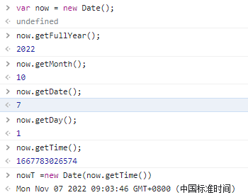
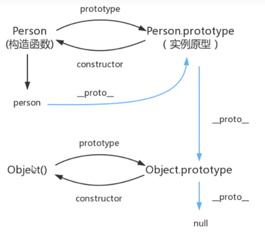
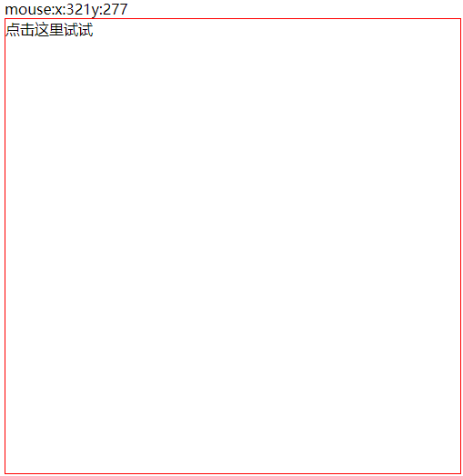

# 1.JavaScript简介

### 1.1概述

javaScript是一门世界上最流行的脚本语言

ECMAScript可以理解为javaScript的一个标准，开发主要使用es6,浏览器大多使用es5。

# 2.使用

### 2.1引入方式

```html
<!--内部引用-->
<script>
    alert("hello  world!")
</script>

<!--外部引入-->
<script src="xxx.js"></script>
```

### 2.2基本语法

```js
//定义变量（变量统一var类型,没有细分的类型）
var num = 2;

//条件控制（与java相同）
if(true){
    alert("yes!")//弹窗
}

//控制台输出
console.log("")


```

### 2.3数据类型

数值，文本，图形，音频，视频。。。

- number

不区分小数和整数

```js
123  //整数
123.1 //浮点数
1.1e2  //科学计数法
-99   //负数
NAN   //NOT A NUMBER
isNAN(NAN)	//判断是否为NAN
Infinity  //无限大
```

- 字符串

“abc”,'abc'

```js
//转义字符
\'
\n	//换行符
\t	//制表符
\u####	//unicode编码

//多行字符首末位+`
`123
	456
	789`

//模板字符串
var name='xzx'
var id=`342425+${name}`	//342425xzx

//大小写转换
变量名.toUpperCase()
变量名.toLowerCase()
```

- 布尔值

true false

- 逻辑运算

&&	||	!

- 比较运算符

=(赋值)

==(判等，类型不一样，值一样)

===（判等，类型和值都一样，一般用这个）

- null（空值）和undefined（未定义）
- 数组

```js
length	//数组长度
indexOf()	//取数组特定位置的值
slice()	//字符串切分
push()	//在数组尾部加入字符
pop()	//在数组尾部弹出字符
unshift()	//在数组头部添加字符
shift()	//在数组头部取出字符
sort()	//排序
reverse()	//颠倒
join()	//连接
```

- 对象

```js
//对象里面的变量键值对赋值，变量名：变量值，变量之间逗号分隔，最后一个变量不需要逗号
var person{
    key1:"value1",
    key2:"value2",
    key3:"value3"
}

//动态增加（删除）对象的属性
delete 对象名.属性名
对象名.属性名='xxx'
```

- Map和Set

Map:存键值对

Set:无序不重复的集合

- iterator（遍历）

```js
//for  of  遍历数组，Map，Set
//局部变量声明	let

for(let x of 变量名){
    
}
```

==注意==

尽量避免浮点数运算，有精度损失。

**‘use strict’严格审查模式，帮助检查潜在的bug。**

# 3.函数及面向对象

### 3.1定义函数

```js
//method one
/*
function 函数名（参数名）{
	函数体
}
*/
function abs(x){
    if(x>0)
    	return x;
    else
        return -x;
}
//method two
/*
var 变量名 = function(参数名){
	函数体
}
*/
var abs = function(x){
    if(x>0)
    	return x;
    else
        return -x;
}
//如果没有执行return，函数也会返回结果，返回的是undefined
//参数问题：javaScript可以传任意个参数，也可以不传参数
//rest	数组类型	可以接收多余的参数，不包含当前的参数
function a(1,2,...rest){
    
}
//arguments	数组	可以接收多余的参数，包含当前的参数
```

### 3.2方法

>apply()

在js中可以控制指向。

```js
//method one
var peole = {
    name:"ruyi",
    birth:2000,
    age:function(){
        var now = new Date().getFullYear();
    	return now-this.birth;
    }
}

//method two
function getAge(){
    var now = new Date().getFullYear();
    return now-this.birth;
}

var peole = {
    name:"ruyi",
    birth:2000,
    age:getAge
}

getAge.apply(people.[])//this指向了people，参数为空
```

### 3.3Date

```js
var now = new Date();
now.getFullYear();	//获得年
now.getMonth();	//月
now.getDate();	//日
now.getDay();	//星期
now.getTime();	//时间戳

//转换
now =new Date(时间戳)
now.toGMTString()
```

output:



### 3.4JSON

在js中一切皆对象，任何js支持的类型都能使用json表示。

- 对象 {}
- 数组[]
- 键值对  key:value

```js
//对象转换为json
var json = JSON.stringify(str);
//json转换为对象
var obj = JSON.parse('{"name":"xzx","age":20}');
```

# 4.面向对象

javaScript，Java，c#

类：模板

对象：具体的实例

在javaScript中有原型的概念(==__ proto __==)，类似java中的class,现在使用==class==

```js
class Student{
    constructor(name){
        this.name = name;
    }
    hello(){
        alert('hello')
    }
}

class StudentA extends Student{
    constructor(name,age){
        super(name);
        this.age=age;
    }
    method(){
	   alert("hello world~");
    }
}
```

>原型链



# 5.操作BOM对象

>浏览器介绍

javaScript&浏览器的关系

javaScript的诞生为了在浏览器中使用脚本运行

BOM：浏览器对象模型

浏览器内核

- IE
- Chrome
- Safari（苹果）
- FireFox
- Opera


第三方浏览器(其内核还是上述浏览器内核)

- QQ浏览器
- 360浏览器
- 2345浏览器


>window

window代表浏览器窗口

```js
window.alert()	//弹窗
window.innerHeight()	//内部高度
window.outerHeight()	//外部高度
window.innerwidth()		//内部宽度
window.outerwigth()		//外部宽度
```


>Navigator

封装了浏览器的信息

```javascript
navigator.appName
'Netscape'
navigator.platform
'Win32'
navigator.userAgent
'Mozilla/5.0 (Windows NT 10.0; Win64; x64) AppleWebKit/537.36 (KHTML, like Gecko) Chrome/106.0.0.0 Safari/537.36'
navigator.appVersion
'5.0 (Windows NT 10.0; Win64; x64) AppleWebKit/537.36 (KHTML, like Gecko) Chrome/106.0.0.0 Safari/537.36'
```

>screen

屏幕尺寸

```javascript
screen.width
1600
screen.height
900
```


>location

代表当前页面的url信息

```javascript
location.host
'localhost:63342'
location.href
'http://localhost:63342/CSS/demo/index.html?_ijt=pf58f4pe7f63rnk503jtq9rb5j'
location.protocol
'http:'
```

>document

```js
document.title
'Title'
document.cookie
'ajs_anonymous_id=c50c52cd-ed60-4be8-a859-46a19483802d; pgv_pvid=1330875296; Hm_lvt_ad29670c49e093f8aa6cbb0f672c1a81=1662369599,1662690795; bad_id7c4f1e30-c255-11ea-91a4-7f87f504790a=e1b352d1-2fe7-11ed-9e23-59cad89490f9; bad_idundefined=e1b352d1-2fe7-11ed-9e23-59cad89490f9; Hm_lvt_866c9be12d4a814454792b1fd0fed295=1662724715; Hm_lvt_2d82027563e189a226fe3c1d766cee4b=1662728135'
```

> history

```js
history.back()
history.forward()
```

# 6.操作DOM对象

浏览器网页就是一个DOM树形结构

- 更新Dom节点
- 遍历Dom节点
- 删除Dom节点
- 添加Dom节点

```html
<!DOCTYPE html>
<html lang="en">
<head>
    <meta charset="UTF-8">
    <title>Title</title>


</head>
<body>
<div id="father">
<h1>title</h1>
<p id="one">p1</p>
<p class="two">p2</p>
</div>

<script>
    //获取节点
    var h1 = document.getElementsByTagName('h1');
    var p1 = document.getElementById("one");
    var p2 = document.getElementsByClassName('two');
    var father =document.getElementById('father');
    //操作文本
    father.innerText='xzx'
    father.innerHTML='<strong>xzx<strong>'
    //操作css
    father.style.color = 'yellow';
    
    //删除节点 p1
    /*
    1.获取其父节点
    2.删除节点
    3.删除多个节点的时候，尤其是数组表示的同一类型的节点，删除前面的，后面的会自动补上 如删除list[1],则list[2]会自动补到list[1],数组长度-1
    */
    var p1father = p1.parentElement;
    p1father.removeChild(p1)
    
    //插入节点
    /*我们一般使用追加的方式插入节点，避免覆盖了原先内容*/
    var p3 = document.createElement('p');
    p3.setAttribute('id','p3');//设置节点的属性
    p3.innerText='p3';//设置节点的文本内容
    father.append(p3)
</script>
</body>
</html>
```

# 7.jQuery

jQuery库里包含了大量的javaScript函数

$(选择器).action()

>事件

鼠标事件，键盘事件

example：获取鼠标坐标

```html
<!DOCTYPE html>
<html lang="en">

<head>
    <meta charset="UTF-8">
    <title>Title</title>
    <script src="http://libs.baidu.com/jquery/2.0.0/jquery.min.js"></script>
    <style>
        #divMove{
            width: 500px;
            height: 500px;
            border: 1px solid red;
        }
    </style>

</head>
<body>
mouse:<span id="mousemove"></span>
<div id="divMove">
    点击这里试试
</div>

<script>
    $(function(){
        $('#divMove').mousemove(function (e){
            $('#mousemove').text('x:'+e.pageX+'y:'+e.pageY)
        })
    });
</script>
</body>
</html>
```



更多操作详见工具手册https://jquery.cuishifeng.cn/
