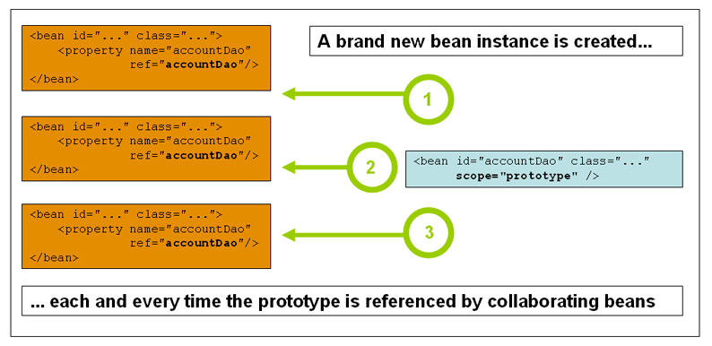

## Spring

### 1.简介

- 2002年，首次推出Spring框架雏形 interface 21框架
- **Rod Johnson**
- 使现有的技术更加容易使用，本身是个大杂烩，，整合现有技术的框架

官网：https://spring.io/projects/spring-framework

各个版本下载：https://docs.spring.io/spring-framework/docs/

GitHub：https://github.com/spring-projects/spring-framework


**优点**

- Spring是一个开源的免费的框架（容器）
- SPringle是一个轻量级的，非入侵式的框架
- 控制反转（IOC），面向切面编程（AOP）
- 支持事务的处理，对框架整合的支持

==Spring就是一个轻量级的控制反转（IOC）和面向切面编程（AOP）的框架==


**结构**


### 2.IOC理论

客户需求的改变，程序无法满足，需要修改代码才能实现。

当客户需求改变时，我们希望通过增加代码而不在原有的代码上修改来满足用户需求。

通俗的来说，我们将对象的创建从程序员手中交给用户，用户可以自主选择需要创建的对象！（set注入）本质上是系统耦合性的降低——IOC


**控制反转IoC(Inversion of Control),是一种设计思想，DI（依赖注入）是实现IOC的一种方式。**在没有IOC的程序中，我们使用面向对象编程，对象的创建与对象的依赖关系完全硬编码在程序中，对象的创建由程序自身控制。控制反转就是将对象的创建交给第三方来实现，在一定程度上降低了系统的耦合性。


采用XML方式配置Bean的时候，Bean的定义信息和实现是分离的，而采用注解的方式可以把两者合为一体，Bean的定义信息直接以注解的形式定义在实现类中，从而达到了零配置的目的。

控制反转是一种通过描述（XML或者注解）并通过第三方去产生或获取特定对象的方式。在Spring中实现控制反转的是IOC容器，其实现方法是依赖注入（Dependency Injection）

### 3.HelloSpring

pom.xml

```xml
<dependency>
    <groupId>org.springframework</groupId>
    <artifactId>spring-webmvc</artifactId>
    <version>5.2.10.RELEASE</version>
</dependency>

<dependency>
    <groupId>org.projectlombok</groupId>
    <artifactId>lombok</artifactId>
    <version>1.18.12</version>
</dependency>
```

pojo(Hello)

```java
package com.ruyi.pojo;

import lombok.AllArgsConstructor;
import lombok.Data;
import lombok.NoArgsConstructor;

@Data
@NoArgsConstructor
@AllArgsConstructor
public class Hello {
    private String str;

}

```

beans.xml

```xml
<?xml version="1.0" encoding="UTF-8"?>
<beans xmlns="http://www.springframework.org/schema/beans"
       xmlns:xsi="http://www.w3.org/2001/XMLSchema-instance"
       xsi:schemaLocation="http://www.springframework.org/schema/beans http://www.springframework.org/schema/beans/spring-beans.xsd">

        <!--
        id:变量名
        class: 对象
        property： 对象中属性值
        -->
        <bean id="hello" class="com.ruyi.pojo.Hello">
            <property name="str" value="Spring"/>
        </bean>
</beans>
```

Test

```java
import com.ruyi.pojo.Hello;
import org.springframework.context.ApplicationContext;
import org.springframework.context.support.ClassPathXmlApplicationContext;

public class Test {
    public static void main(String[] args) {
        //获取Spring的上下文对象
        ApplicationContext context = new ClassPathXmlApplicationContext("beans.xml");
        Hello hello = (Hello)context.getBean("hello");
        System.out.println(hello.toString());
    }
}
```


- Hello对象由Spring创建
- Hello对象的属性由Spring容器设置
- 控制：创建对象的。传统的应用程序由程序本身（程序员通过代码实现）创建，使用Spring后，对象由Spring创建（通过配置文件）
- 反转：程序本身不创建对象，变成被动的接受对象
- 依赖注入：利用set方法注入
- **对象由Spring来创建，管理，装配！**


### 4.IOC创建对象的方式

- 使用无参构造创建对象

- 使用有参构造对象

  - **Constructor argument index**

  ```xml
  <!--参数下标赋值-->
  <bean id="hello" class="com.ruyi.pojo.Hello">
      <constructor-arg index="0" value="Hello"/>
  </bean>
  ```

  - **Constructor argument type matching**

  ```xml
  <!--参数类型赋值-->
  <bean id="hello" class="com.ruyi.pojo.Hello">
      <constructor-arg type="java.lang.String" value="Hello"/> 
  </bean>
  ```

  - **Constructor argument name**

  ```xml
  <!--参数名赋值-->
  <bean id="hello" class="com.ruyi.pojo.Hello">
      <constructor-arg name="name" value="Hello"/>
  </bean>
  ```

  

### 5.配置

##### 5.1别名

```xml
<alias name="hello" alias="你好"/>
```

##### 5.2bean

```xml
<!--
        id:变量名
        class: 对象  包名+类型
        property： 对象中属性值
        name:别名，可以多个
        -->
<bean id="hello" class="com.ruyi.pojo.Hello" name="你好 nihao">
    <constructor-arg name="str" value="Hello"/>
</bean>
```

##### 5.3import

一般用于团队开发，它可以将多个配置文件合并为一个

```xml
<import resource="beans_one.xml"/>
<import resource="beans_two.xml"/>
<import resource="beans_three.xml"/>
```

### 6.依赖注入

##### 6.1构造器注入

即构造器创建对象，见4

##### 6.2set注入

```xml
<?xml version="1.0" encoding="UTF-8"?>
<beans xmlns="http://www.springframework.org/schema/beans"
       xmlns:xsi="http://www.w3.org/2001/XMLSchema-instance"
       xsi:schemaLocation="http://www.springframework.org/schema/beans http://www.springframework.org/schema/beans/spring-beans.xsd">

        <bean id="hello" class="com.ruyi.pojo.Hello"/>
        <bean id="student" class="com.ruyi.pojo.Student">
            <property name="name" value="ruyi"/>
            <property name="hello" ref="hello"/>
            <property name="book" >
                <list>
                    <value>数据挖掘</value>
                    <value>深度学习</value>
                    <value>机器学习</value>
                </list>
            </property>
            <property name="course">
                <array>
                    <value>语文</value>
                    <value>数学</value>
                    <value>英语</value>
                </array>
            </property>
            <property name="card">
                <map>
                    <entry key="卡1" value="中国联通"/>
                    <entry key="卡2" value="中国移动"/>
                </map>
            </property>
            <property name="games">
                <set>
                    <value>omj</value>
                    <value>lol</value>
                    <value>clear happy</value>
                </set>
            </property>
            <property name="info">
                <props>
                    <prop key="sex">男</prop>
                    <prop key="age">24</prop>
                </props>
            </property>
            <property name="single">
                <null/>
            </property>
        </bean>

</beans>
```

**output:**

```java
Student(name=ruyi, hello=Hello(str=null), course=[语文, 数学, 英语], book=[数据挖掘, 深度学习, 机器学习], card={卡1=中国联通, 卡2=中国移动}, games=[omj, lol, clear happy], single=null, info={age=24, sex=男})

```

##### 6.3拓展方式注入

- p命名空间 （属性注入）

```xml
<?xml version="1.0" encoding="UTF-8"?>
<beans xmlns="http://www.springframework.org/schema/beans"
       xmlns:xsi="http://www.w3.org/2001/XMLSchema-instance"
       xmlns:p="http://www.springframework.org/schema/p"
       xsi:schemaLocation="http://www.springframework.org/schema/beans http://www.springframework.org/schema/beans/spring-beans.xsd">

        <bean id="hello" class="com.ruyi.pojo.Hello"/>
        <bean id="student" class="com.ruyi.pojo.Student" p:name="ruyi"/>
</beans>
```


- c命名空间（有参构造注入）

```xml
<?xml version="1.0" encoding="UTF-8"?>
<beans xmlns="http://www.springframework.org/schema/beans"
       xmlns:xsi="http://www.w3.org/2001/XMLSchema-instance"
       xmlns:c="http://www.springframework.org/schema/c"
       xsi:schemaLocation="http://www.springframework.org/schema/beans http://www.springframework.org/schema/beans/spring-beans.xsd">

        <bean id="hello" class="com.ruyi.pojo.Hello" c:str="Hello"/>
        
</beans>
```

==tips：==

需要导入头文件

```xml
xmlns:c="http://www.springframework.org/schema/c"
xmlns:p="http://www.springframework.org/schema/p"
```

##### bean的作用域

- singleton

Spring的默认机制，只产生一个对象。


- prototype

每次从容器中get的时候，都会产生一个新对象



- request
- session
- application
- websocket

### 7.bean的自动装配

- 自动装配是Spring满足bean依赖一种方式
- Spring会在上下文中自动寻找，并自动给bean装配属性


##### 7.1在spring中由三种装配方式

1.在xml中显示的装配

2.在java中显示配置

3.隐式的自动装配bean

```xml
<!--
                byName:会自动在容器上下文中查找，和自己对象set方法后面的值对应的beanid
                byType:会自动在容器上下文中查找，和自己对象属性相同的bean
                -->
<bean id="hello" class="com.ruyi.pojo.Hello" autowire="byType"/>
```

4.使用注解实现自动装配

```xml
<?xml version="1.0" encoding="UTF-8"?>
<beans xmlns="http://www.springframework.org/schema/beans"
    xmlns:xsi="http://www.w3.org/2001/XMLSchema-instance"
    xmlns:context="http://www.springframework.org/schema/context"
    xsi:schemaLocation="http://www.springframework.org/schema/beans
        https://www.springframework.org/schema/beans/spring-beans.xsd
        http://www.springframework.org/schema/context
        https://www.springframework.org/schema/context/spring-context.xsd">

    <context:annotation-config/>

</beans>
```

- 导入context约束

```xml
xmlns:context="http://www.springframework.org/schema/context"


xsi:schemaLocation="http://www.springframework.org/schema/beans
        https://www.springframework.org/schema/beans/spring-beans.xsd
        http://www.springframework.org/schema/context
        https://www.springframework.org/schema/context/spring-context.xsd">
```

- 配置注解

```xml
<context:annotation-config/>
```

**@Autowired**（自动装配）

在属性上标注使用，也可以在set方法上使用

```java
@Autowired
private String str;
```

**@Nullable**

说明该字段可以为null

**@Resource**（自动装配）


@Autowired & @Resource

- 都可以实现自动装配，放在属性字段上使用
- @Autowired通过byType方式，而且必须要求这个对象存在
- @Resource默认通过byName方式实现，如果找不到名字，则通过byType实现，如果都找不到，报错。

### 8.使用注解开发

==前提==

使用注解需要aop包，需要配置注解，导入约束

```xml
<?xml version="1.0" encoding="UTF-8"?>
<beans xmlns="http://www.springframework.org/schema/beans"
    xmlns:xsi="http://www.w3.org/2001/XMLSchema-instance"
    xmlns:context="http://www.springframework.org/schema/context"
    xsi:schemaLocation="http://www.springframework.org/schema/beans
        https://www.springframework.org/schema/beans/spring-beans.xsd
        http://www.springframework.org/schema/context
        https://www.springframework.org/schema/context/spring-context.xsd">
    <!--扫描该包下的注解-->
	<context:component-scan base-package="com.ruyi.pojo"/>
    <context:annotation-config/>

</beans>
```

- @Component
  放在类上使用，说明该类被Spring管理 相当于配置bean,不同层的Component不一样
  
  - @Repository(Dao)
  
  
    - @Service(Service)
  
  
    - @Controller(controller)
  


- @Value

放在属性上或者set方法上使用，给该属性赋值

- @Scope

作用域，放在类上，标志该类的作用域

##### 8.1Java方式替代xml文件实现配置

pojo

```java
package com.ruyi.pojo;
import lombok.Data;

@Data
public class Hello {
    private String str;
}
```

JavaConfig

```java
package com.ruyi.config;

import com.ruyi.pojo.Hello;
import org.springframework.context.annotation.Bean;
import org.springframework.context.annotation.Configuration;

@Configuration
public class JavaConfig {
    @Bean
    public Hello getHello(){
        return  new Hello();
    }
}

```

Test

```java
import com.ruyi.config.JavaConfig;
import com.ruyi.pojo.Hello;
import com.ruyi.pojo.Student;
import org.springframework.context.ApplicationContext;
import org.springframework.context.annotation.AnnotationConfigApplicationContext;
import org.springframework.context.support.ClassPathXmlApplicationContext;

public class Test {
    public static void main(String[] args) {
        ApplicationContext context = new AnnotationConfigApplicationContext(JavaConfig.class);
        Hello hello = (Hello)context.getBean("getHello");
        hello.setStr("hello");
        System.out.println(hello.getStr());
    }
}

```

### 9.代理模式

生活中的例子

​	房屋中介，婚介所

代理模式的种类：

- 静态代理


房东类和代理类都实现了租房接口，客户通过访问代理类实现租房需求。

优点：可以在不改变原有代码的前提下，给程序动态添加一些功能。

- 动态代理

动态代理的代理类是动态生成的，不需要我们自己去写（基于接口—jdk动态代理，基于类—cjlib，java字节码实现）

**基于接口—jdk动态代理**

真实类

```java
package com.ruyi.example;

public class Host implements Rent{
    public void rentHouse(){
        System.out.println("租房");
    }
}
```

接口

```java
package com.ruyi.example;

public interface Rent {
    public void rentHouse();
}
```

动态代理

```java
package com.ruyi.example;

import java.lang.reflect.InvocationHandler;
import java.lang.reflect.Method;
import java.lang.reflect.Proxy;

public class ProxyinvocationHander implements InvocationHandler {
    private Rent rent;
    //通过set方法注入对象
    public void setRent(Rent rent) {
        this.rent = rent;
    }
	//动态创建代理类
    public  Object getProxy(){
        return Proxy.newProxyInstance(this.getClass().getClassLoader(),
                rent.getClass().getInterfaces(),this);
    }

    @Override
    public Object invoke(Object proxy, Method method, Object[] args) throws Throwable {
        return method.invoke(rent,args);
    }
}
```

测试

```java
package com.ruyi.example;

import java.lang.reflect.InvocationHandler;

public class Client {
    public static void main(String[] args) {
        //真实角色
        Host host = new Host();
        //代理角色
        ProxyinvocationHander proxy = new ProxyinvocationHander();
        proxy.setRent(host);
        Rent proxy1 = (Rent)proxy.getProxy();
        proxy1.rentHouse();
    }
}
```

动态代理的好处：

- 可以使真实角色的操作更加纯粹！不用去关注一些公共的业务
- 公共业务发生扩展时，方便集中管理
- 一个动态代理类代理的是一个接口，一般就是对应的一类业务
- 一个动态代理类可以代理多个类，只要是实现了同一个接口即可

代理模式参考：https://blog.csdn.net/weixin_43953283/article/details/125783249

### 10.AOP

##### 10.1什么是AOP

AOP（Aspect Oriented Programming）面向切面编程，通过预编译方式和运行期动态代理实现程序功能的统一维护的一种技术。AOP是OOP的延续，是软件开发中的一个热点。也是Spring框架中的一个重要内容，是函数式编程的一种衍生泛型。利用AOP可以对业务逻辑的各个部分进行隔离，从而使得业务逻辑各部分之间的耦合度降低，提高程序的可重用性，同时提高了开发的效率。


##### 10.2AOP在Spring中的作用

==提供声明式事务：允许用户自定义切面==

- 横切关注点：跨越应用程序多个模块的方法或功能。与业务逻辑无关的，需要关注的部分，就是横切关注点。如：日志，安全，缓存，事务等等
- 切面（Aspect）：横切关注点被模块化的特殊对象。是一个类
- 通知（Advice）:切面必须要完成的工作。类中的方法
- 目标（Target）：被通知的对象
- 代理（Proxy）：向目标对象应用通知之后创建的对象
- 切入点（PointCut）：切面通知执行的 ” 地点“的定义
- 连接点（JointPoint）：与切入点匹配的执行点

##### 10.3实现

导包

```xml
<dependency>
    <groupId>org.aspectj</groupId>
    <artifactId>aspectjweaver</artifactId>
    <version>1.9.7</version>
</dependency>
```

userService(Dao)

```java
package com.ruyi.service;

public interface UserService {
    public void add();
    public void delete();
    public void update();
    public void select();
}
```

userServiceImpl(Dao)

```java
package com.ruyi.service;

public class UserServiceImpl implements UserService{
    @Override
    public void add() {
        System.out.println("执行增加方法！");
    }

    @Override
    public void delete() {
        System.out.println("执行删除方法！");
    }

    @Override
    public void update() {
        System.out.println("执行更新方法！");
    }

    @Override
    public void select() {
        System.out.println("执行选择方法！");
    }
}

```

Log

```java
package com.ruyi.Log;

import org.springframework.aop.MethodBeforeAdvice;

import java.lang.reflect.Method;

public class Log implements MethodBeforeAdvice {
    @Override
    //method:要执行的目标方法
    //object[]:参数
    //object:目标对象
    public void before(Method method, Object[] objects, Object o) throws Throwable {
        System.out.println("执行了"+method.getName()+"方法");
    }
}
```

bean,xml

```xml
<?xml version="1.0" encoding="UTF-8"?>
<beans xmlns="http://www.springframework.org/schema/beans"
       xmlns:xsi="http://www.w3.org/2001/XMLSchema-instance"
       xmlns:aop="http://www.springframework.org/schema/aop"
       xsi:schemaLocation="http://www.springframework.org/schema/beans 
       http://www.springframework.org/schema/beans/spring-beans.xsd
        http://www.springframework.org/schema/aop 
        http://www.springframework.org/schema/aop/spring-aop.xsd">


    <!--注册bean-->
    <bean id="userService" class="com.ruyi.service.UserServiceImpl"/>
    <bean id="log" class="com.ruyi.Log.Log"/>
    <!--方式一：使用原生Spring API接口-->
    <!--配置aop:需要导入aop的约束-->
    <aop:config>
        <!--切入点：expression表达式： execution(要执行的位置)-->
        <aop:pointcut id="pointcut" expression="execution(* com.ruyi.service.UserServiceImpl.*(..))"/>
    <!--执行环绕增加-->
        <aop:advisor advice-ref="log" pointcut-ref="pointcut"/>
    </aop:config>
    
    
    <bean id="myPointCut" class="com.ruyi.Utils.PointCut"/>
    <!--方式二：自定义切面-->
    <aop:config>
        <aop:aspect ref="myPointCut">
            <aop:pointcut id="point" expression="execution(* com.ruyi.service.UserServiceImpl.*(..))"/>

            <aop:before method="before" pointcut-ref="point"/>
        </aop:aspect>
    </aop:config>
    <!--方式三：使用注解-->
    <bean id="annotationcut" class="com.ruyi.Utils.Annotationcut"/>
    <aop:aspectj-autoproxy/>
    
</beans>
```

方式二（自定义类）

```java
package com.ruyi.Utils;

public class PointCut {
    public void before(){
        System.out.println("执行xxx方法");
    }
}

```

方式三（注解方式实现AOP）

```java
package com.ruyi.Utils;

import org.aspectj.lang.ProceedingJoinPoint;
import org.aspectj.lang.annotation.After;
import org.aspectj.lang.annotation.Around;
import org.aspectj.lang.annotation.Aspect;
import org.aspectj.lang.annotation.Before;

@Aspect//标记该类是一个切面
public class Annotationcut {

    @Before("execution(* com.ruyi.service.UserServiceImpl.*(..))")
    public void before(){
        System.out.println("方法执行前");
    }

    @After("execution(* com.ruyi.service.UserServiceImpl.*(..))")
    public void after(){
        System.out.println("方法执行后");
    }

    @Around("execution(* com.ruyi.service.UserServiceImpl.*(..))")
    public void around(ProceedingJoinPoint jp){
        System.out.println(jp.getSignature());
    }
}

```


测试

```java
import com.ruyi.service.UserService;
import org.springframework.context.ApplicationContext;
import org.springframework.context.support.ClassPathXmlApplicationContext;

public class Test {
    public static void main(String[] args) {
        ApplicationContext context = new ClassPathXmlApplicationContext("bean.xml");
        UserService userService = (UserService) context.getBean("userService");
        userService.add();
    }
}
```

结果


### 11整合MyBatis

官方文档：http://mybatis.org/spring-boot-starter/mybatis-spring-boot-autoconfigure/

pom.xml

```xml
<?xml version="1.0" encoding="UTF-8"?>
<project xmlns="http://maven.apache.org/POM/4.0.0"
         xmlns:xsi="http://www.w3.org/2001/XMLSchema-instance"
         xsi:schemaLocation="http://maven.apache.org/POM/4.0.0 http://maven.apache.org/xsd/maven-4.0.0.xsd">
    <modelVersion>4.0.0</modelVersion>

    <groupId>org.example</groupId>
    <artifactId>Spring</artifactId>
    <version>1.0-SNAPSHOT</version>

    <properties>
        <maven.compiler.source>8</maven.compiler.source>
        <maven.compiler.target>8</maven.compiler.target>
    </properties>
    <dependencies>
        <dependency>
            <groupId>org.springframework</groupId>
            <artifactId>spring-webmvc</artifactId>
            <version>5.2.10.RELEASE</version>
        </dependency>
        <dependency>
            <groupId>org.projectlombok</groupId>
            <artifactId>lombok</artifactId>
            <version>1.18.12</version>
        </dependency>
        <dependency>
            <groupId>org.aspectj</groupId>
            <artifactId>aspectjweaver</artifactId>
            <version>1.9.7</version>
        </dependency>
        <dependency>
            <groupId>junit</groupId>
            <artifactId>junit</artifactId>
            <version>4.12</version>
            <scope>test</scope>
        </dependency>
        <dependency>
            <groupId>mysql</groupId>
            <artifactId>mysql-connector-java</artifactId>
            <version>5.1.47</version>
        </dependency>
        <dependency>
            <groupId>org.mybatis</groupId>
            <artifactId>mybatis</artifactId>
            <version>3.4.6</version>
        </dependency>
        <dependency>
            <groupId>org.springframework</groupId>
            <artifactId>spring-jdbc</artifactId>
            <version>5.3.16</version>
        </dependency>
        <dependency>
            <groupId>org.mybatis</groupId>
            <artifactId>mybatis-spring</artifactId>
            <version>2.0.2</version>
        </dependency>
    </dependencies>
</project>
```

User(pojo)

```java
package com.ruyi.pojo;

import lombok.AllArgsConstructor;
import lombok.Data;
import lombok.NoArgsConstructor;

@Data
@AllArgsConstructor
@NoArgsConstructor
public class User {
    private int id;
    private String name;
    private String psw;

}
```

UserMapper.xml(dao)

```xml
<?xml version="1.0" encoding="UTF-8" ?>
<!DOCTYPE mapper
        PUBLIC "-//mybatis.org//DTD Mapper 3.0//EN"
        "https://mybatis.org/dtd/mybatis-3-mapper.dtd">
<!-- 绑定Mapper-->
<mapper namespace="com.ruyi.dao.UserMapper">
    <!--查询语句-->
    <select id="getUserInfo" resultType="com.ruyi.pojo.User">
        select * from MyBatis.User
    </select>
</mapper>

```

UserMapper(dao)

```java
package com.ruyi.dao;

import com.ruyi.pojo.User;

import java.util.List;

public interface UserMapper {
    public List<User> getUserInfo();
}

```

UserMapperImpl(dao)

```java
package com.ruyi.dao;

import com.ruyi.pojo.User;
import org.apache.ibatis.session.SqlSessionFactory;
import org.mybatis.spring.SqlSessionTemplate;

import java.util.List;

public class UserMapperImpl implements UserMapper{

    private SqlSessionTemplate sqlSession;

    public void setSqlSession(SqlSessionTemplate sqlSession) {
        this.sqlSession = sqlSession;
    }

    @Override
    public List<User> getUserInfo() {
        UserMapper userMapper = sqlSession.getMapper(UserMapper.class);
        return userMapper.getUserInfo();
    }
}

```

bean.xml

```xml
<?xml version="1.0" encoding="UTF-8"?>
<beans xmlns="http://www.springframework.org/schema/beans"
       xmlns:xsi="http://www.w3.org/2001/XMLSchema-instance"
       xmlns:aop="http://www.springframework.org/schema/aop"
       xsi:schemaLocation="http://www.springframework.org/schema/beans 
       http://www.springframework.org/schema/beans/spring-beans.xsd
        http://www.springframework.org/schema/aop 
        http://www.springframework.org/schema/aop/spring-aop.xsd">

    <!--DataSource:使用Spring的数据源替代Mybatis的配置-->
    <bean id="dataSource" class="org.springframework.jdbc.datasource.DriverManagerDataSource">
        <property name="driverClassName" value="com.mysql.jdbc.Driver"/>
        <property name="url" value="jdbc:mysql://localhost:3306/MyBatis?useSSL=false&amp;useUnicode=true&amp;characterEncoding=utf-8"/>
        <property name="username" value="root"/>
        <property name="password" value="123456"/>
    </bean>

    <!--sqlSessionFactory-->
    <bean id="sqlSessionFactory" class="org.mybatis.spring.SqlSessionFactoryBean">
        <property name="dataSource" ref="dataSource"/>
        <property name="configLocation" value="classpath:mybatis_config.xml"/>
        <property name="mapperLocations" value="classpath:com/ruyi/dao/*.xml"/>
    </bean>
    <bean id="sqlSession" class="org.mybatis.spring.SqlSessionTemplate">
        <!--只能使用构造器注入-->
        <constructor-arg index="0" ref="sqlSessionFactory"/>
    </bean>

    <bean id="userMapper" class="com.ruyi.dao.UserMapperImpl">
        <property name="sqlSession" ref="sqlSession"/>
    </bean>
</beans>
```

Test

```java
import com.ruyi.dao.UserMapper;
import com.ruyi.pojo.User;
import org.springframework.context.ApplicationContext;
import org.springframework.context.support.ClassPathXmlApplicationContext;

import java.util.List;

public class Test {
    public static void main(String[] args) {
        ApplicationContext context = new ClassPathXmlApplicationContext("bean.xml");
        UserMapper userService = context.getBean("userMapper",UserMapper.class);
        List<User> userList = userService.getUserInfo();

        for(User user: userList){
            System.out.println(user);
        }
    }
}

```

方式二

UserMapperImpl2(dao)

```java
package com.ruyi.dao;

import com.ruyi.pojo.User;
import org.apache.ibatis.session.SqlSession;
import org.mybatis.spring.support.SqlSessionDaoSupport;

import java.util.List;

public class UserMapperImpl2 extends SqlSessionDaoSupport implements UserMapper{
    @Override
    public List<User> getUserInfo() {
        return getSqlSession().getMapper(UserMapper.class).getUserInfo();
    }
}

```

bean.xml

```xml
<?xml version="1.0" encoding="UTF-8"?>
<beans xmlns="http://www.springframework.org/schema/beans"
       xmlns:xsi="http://www.w3.org/2001/XMLSchema-instance"
       xmlns:aop="http://www.springframework.org/schema/aop"
       xsi:schemaLocation="http://www.springframework.org/schema/beans 
       http://www.springframework.org/schema/beans/spring-beans.xsd
        http://www.springframework.org/schema/aop 
        http://www.springframework.org/schema/aop/spring-aop.xsd">

    <!--DataSource:使用Spring的数据源替代Mybatis的配置-->
    <bean id="dataSource" class="org.springframework.jdbc.datasource.DriverManagerDataSource">
        <property name="driverClassName" value="com.mysql.jdbc.Driver"/>
        <property name="url" value="jdbc:mysql://localhost:3306/MyBatis?useSSL=false&amp;useUnicode=true&amp;characterEncoding=utf-8"/>
        <property name="username" value="root"/>
        <property name="password" value="123456"/>
    </bean>

    <!--sqlSessionFactory-->
    <bean id="sqlSessionFactory" class="org.mybatis.spring.SqlSessionFactoryBean">
        <property name="dataSource" ref="dataSource"/>
        <property name="configLocation" value="classpath:mybatis_config.xml"/>
        <property name="mapperLocations" value="classpath:com/ruyi/dao/*.xml"/>
    </bean>

    <bean id="userMapper2" class="com.ruyi.dao.UserMapperImpl2">
        <property name="sqlSessionFactory" ref="sqlSessionFactory"/>
    </bean>

</beans>
```

### 12.声明式事务

bean.xml

```xml
<?xml version="1.0" encoding="UTF-8"?>
<beans xmlns="http://www.springframework.org/schema/beans"
       xmlns:xsi="http://www.w3.org/2001/XMLSchema-instance"
       xmlns:aop="http://www.springframework.org/schema/aop" 
       xmlns:tx="http://www.springframework.org/schema/tx"
       xsi:schemaLocation="http://www.springframework.org/schema/beans 
       http://www.springframework.org/schema/beans/spring-beans.xsd
        http://www.springframework.org/schema/aop 
        http://www.springframework.org/schema/aop/spring-aop.xsd
        http://www.springframework.org/schema/tx
        http://www.springframework.org/schema/tx/spring-tx.xsd">

    <!--DataSource:使用Spring的数据源替代Mybatis的配置-->
    <bean id="dataSource" class="org.springframework.jdbc.datasource.DriverManagerDataSource">
        <property name="driverClassName" value="com.mysql.jdbc.Driver"/>
        <property name="url" value="jdbc:mysql://localhost:3306/MyBatis?useSSL=false&amp;useUnicode=true&amp;characterEncoding=utf-8"/>
        <property name="username" value="root"/>
        <property name="password" value="123456"/>
    </bean>

    <!--sqlSessionFactory-->
    <bean id="sqlSessionFactory" class="org.mybatis.spring.SqlSessionFactoryBean">
        <property name="dataSource" ref="dataSource"/>
        <property name="configLocation" value="classpath:mybatis_config.xml"/>
        <property name="mapperLocations" value="classpath:com/ruyi/dao/*.xml"/>
    </bean>

    <bean id="sqlSession" class="org.mybatis.spring.SqlSessionTemplate">
        <!--只能使用构造器注入-->
        <constructor-arg index="0" ref="sqlSessionFactory"/>
    </bean>

    <bean id="userMapper" class="com.ruyi.dao.UserMapperImpl">
        <property name="sqlSessionFactory" ref="sqlSessionFactory"/>
    </bean>

    <bean id="transactionManager" class="org.springframework.jdbc.datasource.DataSourceTransactionManager">
        <property name="dataSource" ref="dataSource"/>
    </bean>

    <tx:advice id="txAdvice" transaction-manager="transactionManager">
        <!--给哪些方法配置事务-->
        <!--配置事务的传播特性-->
        <tx:attributes>
            <tx:method name="*" propagation="REQUIRED"/>
        </tx:attributes>
    </tx:advice>

    <aop:config>
        <aop:pointcut id="txPointCut" expression="execution(* com.ruyi.dao.*.*(..))"/>
        <aop:advisor advice-ref="txAdvice" pointcut-ref="txPointCut"/>
    </aop:config>
</beans>
```

UserMapperImpl(dao)

```java
package com.ruyi.dao;

import com.ruyi.pojo.User;
import org.apache.ibatis.session.SqlSessionFactory;
import org.mybatis.spring.SqlSessionTemplate;
import org.mybatis.spring.support.SqlSessionDaoSupport;


import java.util.List;


public class UserMapperImpl extends SqlSessionDaoSupport implements UserMapper{


    public List<User> getUserInfo() {
        UserMapper userMapper = getSqlSession().getMapper(UserMapper.class);
        User user =new User(7,"cheng","asd");
        userMapper.addUser(user);
        return userMapper.getUserInfo();
    }


    public int addUser(User user) {
        return getSqlSession().getMapper(UserMapper.class).addUser(user);
    }
}

```

