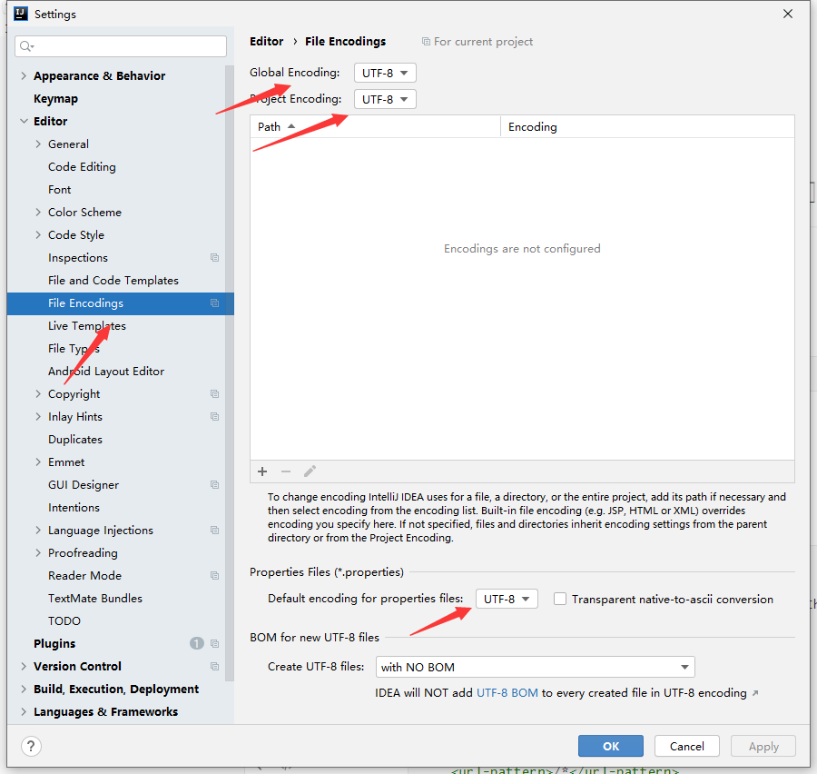

### 1.MVC回顾

##### 1.1简介

MVC是一种模型设计规范

- model（模型）

数据模型，提供要展示的数据，因此包含数据和行为，可以认为是领域模型或javaBean组件（包含数据和行为），不过现在一般都分离开：数据层（dao）和服务层（行为Service）.也就是模型提供了模型数据查询和模型数据的状态更新等功能，包括数据和业务。

- view（视图）

负责进行模型的展示，一般就是我们见到的界面，客户想看见的东西。

- controller（控制器）

接受用户请求，委托给模型进行处理处理完毕后把返回的模型数据返回给视图，由视图负责展示。

经典的MVC为JSP+servlet+javabean的模式


##### 1.2历史

- model one


在web早期开发中，通常采用视图层+模型层双层架构，架构简单，适合小型项目开发。但是JSP承担的任务太重，不方便维护。

- model two


1.用户发起请求

2.Servlet接收请求数据，并调用对应的业务逻辑方法

3.业务处理完毕，返回更新后的数据给servlet

4.servlet转向JSP，由JSP渲染网页

5.相应给前端更新后的网页

各层之间的职责：

controller

1.取得表单数据	

2.调用业务逻辑	

3.转向指定页面

view

1.显示页面

model

1.业务逻辑

2.保存数据状态

### 2.回顾Servlet

HelloServlet

```java
package com.ruyi.servlet;

import javax.servlet.ServletException;
import javax.servlet.http.HttpServlet;
import javax.servlet.http.HttpServletRequest;
import javax.servlet.http.HttpServletResponse;
import java.io.IOException;

public class HelloServlet extends HttpServlet {
    //获取前端参数
    protected void doGet(HttpServletRequest req, HttpServletResponse resp)throws ServletException, IOException{
        String method = req.getParameter("method");
        if(method.equals("add")){
            req.getSession().setAttribute("msg","add()");
        }
        if(method.equals("delete")){
            req.getSession().setAttribute("msg","delete())");
        }

        req.getRequestDispatcher("/WEB-INF/test.jsp").forward(req,resp);
    }

    protected void doPost(HttpServletRequest req, HttpServletResponse resp)throws ServletException, IOException{
        doGet(req,resp);
    }
}

```

test.jsp

```jsp
<%--
  Created by IntelliJ IDEA.
  User: RuYi
  Date: 2022/11/14
  Time: 16:17
  To change this template use File | Settings | File Templates.
--%>
<%@ page contentType="text/html;charset=UTF-8" language="java" %>
<html>
<head>
    <title>Title</title>
</head>
<body>
${msg}
</body>
</html>

```

web.xml

```xml
<?xml version="1.0" encoding="UTF-8"?>
<web-app xmlns="http://xmlns.jcp.org/xml/ns/javaee"
         xmlns:xsi="http://www.w3.org/2001/XMLSchema-instance"
         xsi:schemaLocation="http://xmlns.jcp.org/xml/ns/javaee http://xmlns.jcp.org/xml/ns/javaee/web-app_4_0.xsd"
         version="4.0">
    
    
    
    <servlet>
        <servlet-name>hello</servlet-name>
        <servlet-class>com.ruyi.servlet.HelloServlet</servlet-class>
    </servlet>
    
    <servlet-mapping>
        <servlet-name>hello</servlet-name>
        <url-pattern>/hello</url-pattern>
    </servlet-mapping>

<!--    <session-config>-->
<!--        <session-timeout>15</session-timeout>-->
<!--    </session-config>-->
</web-app>
```


测试


==可能遇到的问题：==

```
14-Nov-2022 17:06:48.455 严重 [RMI TCP Connection(3)-127.0.0.1] org.apache.tomcat.util.modeler.BaseModelMBean.invoke 调用方法[manageApp]时发生异常
	java.lang.IllegalStateException: 启动子级时出错
```

路径映射时没有+/


还有可能打包时没有lib文件，需要手动创建lib并导入jar包


乱码问题


### 3.SpringMVC执行流程


1. DispatcherServlet表示前置控制器，是整个SpringMVC的控制中心。用户发出请求，DispatcherServlet接收请求并拦截请求。
   - 我们假设请求的url为：http://localhost:8080/SpringMVC/hello
   - http://;localhost:8080    服务器域名
   - SpringMVC是部署在服务器上的web站点
   - hello表示控制器，是具体页面
   - 上述url表示请求位于服务器localhost：8080上的SpringMVC站点的hello控制器
2. HandlerMapping为处理器映射。DispatcherServlet调用HandlerMapping，HandlerMapping根据请求的url查找Handler
3. HandlerExecution表示具体的Handler,其主要作用是根据url查找控制器，如上述url查找的控制器为hello控制器
4. HandlerExecution将解析后的信息传输给DispatcherServlet
5. HandlerAdapter表示处理器适配器，按照一定的规则去执行Handler
6. Handler让具体的Controller执行
7. Controller将具体的执行信息返回给HandlerAdapter，如ModelAndView
8. HandlerAdapter将具体的视图逻辑名或模型传递给DispatcherServlet
9. DispatcherServlet调用视图解析器（ViewResolver）来解析HandlerAdapter传递的逻辑视图名
10. 视图解析器将解析的逻辑视图名传给DispatcherServlet
11. DispatcherServlet根据视图解析器解析的试图结果，调用具体的视图
12. 最终视图呈现给用户


代码层面理解执行流程

HelloController

```java
package com.ruyi.controller;

import org.springframework.web.servlet.ModelAndView;
import org.springframework.web.servlet.mvc.Controller;

import javax.servlet.http.HttpServletRequest;
import javax.servlet.http.HttpServletResponse;

public class HelloController implements Controller {
    @Override
    public ModelAndView handleRequest(HttpServletRequest request, HttpServletResponse response) throws Exception {
        ModelAndView mv = new ModelAndView();
        //业务层
        mv.addObject("msg","hello SpringMVC");
        //视图跳转
        mv.setViewName("test");
        return mv;
    }
}
```

springmvc-servlet

```xml
<?xml version="1.0" encoding="UTF-8"?>
<beans xmlns="http://www.springframework.org/schema/beans"
       xmlns:xsi="http://www.w3.org/2001/XMLSchema-instance"
       xsi:schemaLocation="http://www.springframework.org/schema/beans http://www.springframework.org/schema/beans/spring-beans.xsd">


    <!--处理器映射器-->
    <bean class="org.springframework.web.servlet.handler.BeanNameUrlHandlerMapping"/>
    <!--处理器适配器-->
    <bean class="org.springframework.web.servlet.mvc.SimpleControllerHandlerAdapter"/>
    <!--视图解析器-->
    <bean class="org.springframework.web.servlet.view.InternalResourceViewResolver" id="internalResourceViewResolver">
        <property name="prefix" value="/WEB-INF/jsp/"/>
        <property name="suffix" value=".jsp"/>
    </bean>

    <bean id="/hello" class="com.ruyi.controller.HelloController"/>

</beans>
```

web.xml

```xml
<?xml version="1.0" encoding="UTF-8"?>
<web-app xmlns="http://xmlns.jcp.org/xml/ns/javaee"
         xmlns:xsi="http://www.w3.org/2001/XMLSchema-instance"
         xsi:schemaLocation="http://xmlns.jcp.org/xml/ns/javaee http://xmlns.jcp.org/xml/ns/javaee/web-app_4_0.xsd"
         version="4.0">

    <!--配置DispatcherServlet-->
    <servlet>
        <servlet-name>springmvc</servlet-name>
        <servlet-class>org.springframework.web.servlet.DispatcherServlet</servlet-class>
        <!--绑定Spring配置文件-->
        <init-param>
            <param-name>contextConfigLocation</param-name>
            <param-value>classpath:springmvc-servlet.xml</param-value>
        </init-param>
        <!--设置启动级别-->
        <load-on-startup>1</load-on-startup>
    </servlet>


    <!--
    /   匹配所有请求，不会匹配jsp页面
    /*  匹配所有请求，包括jsp
    -->
    <servlet-mapping>
        <servlet-name>springmvc</servlet-name>
        <url-pattern>/</url-pattern>
    </servlet-mapping>
</web-app>
```

result:


### 4.使用注解实现springmvc入门

web.xml

```xml
<?xml version="1.0" encoding="UTF-8"?>
<web-app xmlns="http://xmlns.jcp.org/xml/ns/javaee"
         xmlns:xsi="http://www.w3.org/2001/XMLSchema-instance"
         xsi:schemaLocation="http://xmlns.jcp.org/xml/ns/javaee http://xmlns.jcp.org/xml/ns/javaee/web-app_4_0.xsd"
         version="4.0">

    <!--配置DispatcherServlet-->
    <servlet>
        <servlet-name>springmvc</servlet-name>
        <servlet-class>org.springframework.web.servlet.DispatcherServlet</servlet-class>
        <!--绑定Spring配置文件-->
        <init-param>
            <param-name>contextConfigLocation</param-name>
            <param-value>classpath:springmvc-servlet.xml</param-value>
        </init-param>
        <!--设置启动级别-->
        <load-on-startup>1</load-on-startup>
    </servlet>


    <!--
    /   匹配所有请求，不会匹配jsp页面
    /*  匹配所有请求，包括jsp
    -->
    <servlet-mapping>
        <servlet-name>springmvc</servlet-name>
        <url-pattern>/</url-pattern>
    </servlet-mapping>
</web-app>
```

springmvc-servlet.xml

```xml
<beans xmlns="http://www.springframework.org/schema/beans"
       xmlns:xsi="http://www.w3.org/2001/XMLSchema-instance"
       xmlns:context="http://www.springframework.org/schema/context"
       xmlns:mvc="http://www.springframework.org/schema/mvc"
       xsi:schemaLocation="http://www.springframework.org/schema/beans
        https://www.springframework.org/schema/beans/spring-beans.xsd
        http://www.springframework.org/schema/context
        https://www.springframework.org/schema/context/spring-context.xsd
        http://www.springframework.org/schema/mvc
        https://www.springframework.org/schema/mvc/spring-mvc.xsd">


    <context:component-scan base-package="com.ruyi.controller"/>
    <mvc:default-servlet-handler/>
    <mvc:annotation-driven/>
    <!--视图解析器-->
    <bean class="org.springframework.web.servlet.view.InternalResourceViewResolver" id="internalResourceViewResolver">
        <property name="prefix" value="/WEB-INF/jsp/"/>
        <property name="suffix" value=".jsp"/>
    </bean>


</beans>
```

HelloController.java

```java
package com.ruyi.controller;

import org.springframework.stereotype.Controller;
import org.springframework.ui.Model;
import org.springframework.web.bind.annotation.RequestMapping;


@Controller
public class HelloController {
    @RequestMapping("/hello")
    public String hello(Model model){
        model.addAttribute("msg","hello springMVC");
        return "hello";
    }
}

```

### 5.Controller配置

- 控制器提供访问应用程序的行为，通常通过接口定义或注释定义两种方式实现
- 控制器负责解析用户的请求并将其转换为一个模型
- 在SpringMVC中，一个控制器可以包含多个方法
- 在SpringMVC中，对于Controller的配置方式有很多种


> 实现controller接口

编写TestController.java

```java
public class TestController implements Controller {
    @Override
    public ModelAndView handleRequest(HttpServletRequest request, HttpServletResponse response) throws Exception {
        return null;
    }
}
```

注册bean

```xml
<bean name="/hello" class="com.ruyi.controller.TestController"/>
```


> 使用注解@Controller

- @Controller注解用于声明Spring类的实例是一个控制器

- Spring可以使用扫描机制来找到应用程序中所有基于注解的控制器类，为了保证Spring能找到你的控制器，需要在配置文件中声明

  ```xml
  <context:component-scan base-package="com.ruyi.controller"/>
  ```

- HelloController.java

  ```java
  package com.ruyi.controller;
  
  import org.springframework.stereotype.Controller;
  import org.springframework.ui.Model;
  import org.springframework.web.bind.annotation.RequestMapping;
  
  
  @Controller
  public class HelloController {
      @RequestMapping("/hello")
      public String hello(Model model){
          model.addAttribute("msg","hello springMVC");
          return "hello";
      }
  }
  ```


### 6.RequestMapping

@RequestMapping注解用于映射url到控制器类或一个特定的处理程序方法。可用于类或方法上。用于类上，表示类中的所有响应请求的方法都是以该地址作为父路径。

- 只注解在方法上面

```java
@Controller
public class HelloController {
    @RequestMapping("/hello")
    public String hello(Model model){
        model.addAttribute("msg","hello springMVC");
        return "hello";
    }
}
```

访问路径：http://localhost:8080/hello

- 同时注解类与方法

```java
@Controller
@RequestMapping("/ruyi")
public class HelloController {
    @RequestMapping("/hello")
    public String hello(Model model){
        model.addAttribute("msg","hello springMVC");
        return "hello";
    }
}
```

访问路径：http://localhost:8080/ruyi/hello

### 7.RestFul风格

##### 7.1概念

RestFul就是一个资源定位及资源操作的风格。不是标准也不是协议，只是一种风格。基于这个风格设计的软件可以**更简洁**，**更有层次**，**更安全**，更易于实现缓存等机制

##### 7.2功能

- 资源：互联网所有的事物都可以被抽象为资源
- 资源操作：使用POST（添加）,DRLETE（删除）,PUT（修改）,GET（查询），使用不同方法对资源进行操作


**传统的方式操作资源：**

- http://127.0.0.1/item/queryItem.action?id=6		查询
- http://127.0.0.1/item/addItem.action		新增
- http://127.0.0.1/item/updateItem.action?id=6		更新
- http://127.0.0.1/item/deleteItem.action?id=6		删除


**使用RestFul操作资源：**

- http://127.0.0.1/item/1		查询
- http://127.0.0.1/item		新增
- http://127.0.0.1/item		更新
- http://127.0.0.1/item/1		删除


example

```java
public class RestFulController {
    @RequestMapping("/add/{a}/{b}")
    public String example(@PathVariable int a,@PathVariable int b, Model model){
        int res = a+b;
        model.addAttribute("msg","a+b="+String.valueOf(res));
        return "hello";
    }
}
```

@PathVariable 可以将方法的参数值对应到一个url模板变量上

还可以通过 **@GetMapping**，**@PostMapping**,**@PutMapping**,**@DeleteMapping**,指定特定的方式操作资源。如 @GetMapping("/add/{a}/{b}")和@RequestMapping(value = "/add/{a}/{b}",emthod = RequestMethod.GET)效果相同。

==RestFul风格优势：==

- 同一个url可以通过不同的方式访问，从而达到不同的效果，实现url的复用
- url中不会暴露更多源码的细节，更加安全
- 路径更加简洁，更有层次

### 8.转发和重定向

- 转发

  - 有视图解析器、

  ```java
  @Controller
  public class HelloController {
      @RequestMapping("/hello")
      public String hello(Model model){
          model.addAttribute("msg","hello springMVC");
          return "hello";
      }
  }
  ```

  视图解析器拼接了前缀(/WEB-INF/jsp/)和后缀（.jsp）

  - 无视图解析器

  ```java
  @Controller
  public class HelloController {
      @RequestMapping("/hello")
      public String hello(Model model){
          model.addAttribute("msg","hello springMVC");
          return "/WEB-INF/jsp/hello.jsp";
      }
  }
  ```

  ==tip==

  需要全路径名

- 重定向

  - 有视图解析器

  ```java
  @Controller
  public class HelloController {
      @RequestMapping("/hello")
      public String hello(Model model){
          model.addAttribute("msg","hello springMVC");
          return "redirect:/index.jsp";
      }
  }
  ```

  ==tips==

  index.jsp后缀.jsp不可以省略，重定向只要在需要跳转的页面前+redirect:即可

  - 无视图解析器

  ```java
  @Controller
  public class HelloController {
      @RequestMapping("/hello")
      public String hello(Model model){
          model.addAttribute("msg","hello springMVC");
          return "redirect:/index.jsp";
      }
  }
  ```

  ==tip==

question:无法重定向WEB-INF文件夹下的资源？

answer：是被服务器保护了，WEB-INF是Java的WEB应用的安全目录。也就是客户端无法访问，只有服务端可以源访问的目录。重定向是两次不同请求，而且是在客户端完成的。


### 9.接受请求及数据回显

- **传参**

前端参数字段名与后端一样时，可以直接传参。前端参数字段名与后端不一样时，可以使用@RequestParam("username")去映射。一般为了代码的可读性，每个传值的参数字段名前都会加上@RequestParam。如果需要传一个对象，需要将对象中的每个属性的名称一一对应，否则没有对应的属性会为null。

```java
@Controller
public class HelloController {
    @RequestMapping("/hello")
    public String hello(@RequestParam("username") String name , Model model){
        model.addAttribute("msg",name);
        return "hello";
    }
}
```


- 数据回显

一般可以通过Model，ModelAndView，ModelMap将数据回显

```java
public String hello(@RequestParam("username") String name , ModelAndView model){
        model.addObject("msg",name);
        return "hello";
    }


public String hello(@RequestParam("username") String name , Model model){
        model.addAttribute("msg",name);
        return "hello";
    }
```

### 10.乱码问题

- 过滤器解决乱码

**自定义Filter**

EncodingFilter

```java
package com.ruyi.filter;


import javax.servlet.*;
import java.io.IOException;

public class EncodingFilter implements Filter {

    @Override
    public void init(FilterConfig filterConfig) throws ServletException {

    }

    @Override
    public void doFilter(ServletRequest servletRequest, ServletResponse servletResponse, FilterChain filterChain) throws IOException, ServletException {
        servletRequest.setCharacterEncoding("utf-8");
        servletResponse.setCharacterEncoding("utf-8");

        filterChain.doFilter(servletRequest,servletResponse);
    }

    @Override
    public void destroy() {

    }
}
```

web.xml

```xml
<filter>
        <filter-name>encoding</filter-name>
        <filter-class>com.ruyi.filter.EncodingFilter</filter-class>
    </filter>
    <filter-mapping>
        <filter-name>encoding</filter-name>
        <url-pattern>/*</url-pattern>
    </filter-mapping>
```

使用Spring的filter配置

```xml
<filter>
    <filter-name>encoding</filter-name>
    <filter-class>org.springframework.web.filter.CharacterEncodingFilter</filter-class>
    <init-param>
        <param-name>encoding</param-name>
        <param-value>utf-8</param-value>
    </init-param>
</filter>
<filter-mapping>
    <filter-name>encoding</filter-name>
    <url-pattern>/*</url-pattern>
</filter-mapping>
```

- Tomcat

```xml
<Connector URLEncoding="utf-8" port="8080" protocol="HTTP/1.1"
           connectionTimeout="20000"
           redirectPort="8443" />
```

### 11.JSON

- JSON(JavaScript Object Notation,JS对象标记)是一种轻量级的数据交换格式，目前使用特别广泛。
- 采用完全独立于编程语言的文本格式来存储和表示数据
- 简洁和清晰的层次结构使得JSON成为理想的数据交换语言
- 易于编写和阅读，同时也易于机器解析和生成，并有效地提升网络传输效率

在JavaScript语言中，一切都是对象。因此，任何JavaScript支持的类型都可以通过JSON来表示，例如字符串，数字，对象，数组等。

- 对象表示为键值对，数据由逗号分隔
- 花括号保存对象
- 方括号保存数组

```json
{"name":"ruyi","age":"18","sex":"man"}
```

JSON&JavaScript

JSON是JavaScript对象的字符串表示法，它使用文本表示一个JS对象的信息，本质是一个字符串。

- JSON转JavaScript对象

```java
var obj = JSON.pase()
```

- JavaScript对象转JSON

```java
var json = JSON.stringify()
```

### 12.Jackson

- 导包

```xml
<dependency>
    <groupId>com.fasterxml.jackson.core</groupId>
    <artifactId>jackson-databind</artifactId>
    <version>2.9.8</version>
</dependency>
```

- springmvc-service.xml

```xml
<mvc:annotation-driven>
    <mvc:message-converters register-defaults="true">
        <bean class="org.springframework.http.converter.StringHttpMessageConverter">
            <constructor-arg value="UTF-8"/>
        </bean>
        <bean class="org.springframework.http.converter.json.MappingJackson2HttpMessageConverter">
            <property name="objectMapper">
                <bean class="org.springframework.http.converter.json.Jackson2ObjectMapperFactoryBean">
                    <property name="failOnEmptyBeans" value="false"/>
                </bean>
            </property>
        </bean>
    </mvc:message-converters>
</mvc:annotation-driven>
```

- UserController.java

```java
package com.ruyi.controller;

import com.fasterxml.jackson.core.JsonProcessingException;
import com.fasterxml.jackson.databind.ObjectMapper;
import com.ruyi.pojo.User;
import org.springframework.stereotype.Controller;
import org.springframework.web.bind.annotation.RequestMapping;
import org.springframework.web.bind.annotation.ResponseBody;

@Controller
public class UserController {

    @ResponseBody
    @RequestMapping("/user")
    public String jsonOne() throws JsonProcessingException {
        //jackson,  ObjectMapper
        ObjectMapper mapper =new ObjectMapper();
        User user =new User("ruyi","男",18);
        String str = mapper.writeValueAsString(user);
        return str;
    }
}
```

==problem:乱码依旧没有解决==

时间输出

```java
package com.ruyi.controller;

import com.fasterxml.jackson.core.JsonProcessingException;
import com.fasterxml.jackson.databind.ObjectMapper;
import org.springframework.stereotype.Controller;
import org.springframework.web.bind.annotation.RequestMapping;
import org.springframework.web.bind.annotation.ResponseBody;

import java.text.SimpleDateFormat;
import java.util.Date;
import java.util.logging.SimpleFormatter;

@Controller
public class UserController {

    @ResponseBody
    @RequestMapping("/user")
    public String jsonOne() throws JsonProcessingException {
        //jackson,  ObjectMapper
        ObjectMapper mapper =new ObjectMapper();
        Date date =new Date();
        SimpleDateFormat sdf =new SimpleDateFormat("yyyy-MM-dd HH:mm:ss");
        String str = mapper.writeValueAsString(sdf.format(date));
        return str;
    }
}

```

**补充：也可以把jackson抽取为工具类直接调用**


>fastjson

```xml
<dependency>
    <groupId>com.alibaba</groupId>
    <artifactId>fastjson</artifactId>
    <version>1.2.68</version>
</dependency>
```

```java
public String jsonOne(){
    //jackson,  ObjectMapper
    String str = JSON.toJSONString("如意");
    return str;
}
```


### 13.项目实战

- 数据库创建

```sql
CREATE TABLE `Book`(
	`BookId` INT(10)  PRIMARY KEY NOT NULL,
	`BookName` NVARCHAR(20)  DEFAULT NULL,
	`BookCounts` NVARCHAR(20) DEFAULT NULL,
	`BookDesc` NVARCHAR(40) DEFAULT NULL
)ENGINE = INNODB DEFAULT CHARSET =utf8;

INSERT INTO Book(BookId,`BookName`,BookCounts,BookDesc) VALUES (1,"家","10","巴金的三部曲");
INSERT INTO Book(BookId,`BookName`,BookCounts,BookDesc) VALUES (2,"三国演义","5","四大名著之一");
INSERT INTO Book(BookId,`BookName`,BookCounts,BookDesc) VALUES (3,"丧钟为谁而鸣","2","战争题材的小说");
INSERT INTO Book(BookId,`BookName`,BookCounts,BookDesc) VALUES (4,"小时的孩子","15","人性的考验");
```

- pom.xml

```xml
<?xml version="1.0" encoding="UTF-8"?>
<project xmlns="http://maven.apache.org/POM/4.0.0"
         xmlns:xsi="http://www.w3.org/2001/XMLSchema-instance"
         xsi:schemaLocation="http://maven.apache.org/POM/4.0.0 http://maven.apache.org/xsd/maven-4.0.0.xsd">
    <modelVersion>4.0.0</modelVersion>

    <groupId>org.example</groupId>
    <artifactId>Demo</artifactId>
    <version>1.0-SNAPSHOT</version>

    <properties>
        <maven.compiler.source>8</maven.compiler.source>
        <maven.compiler.target>8</maven.compiler.target>
    </properties>
    <dependencies>
        <!--mysql依赖-->
        <dependency>
            <groupId>mysql</groupId>
            <artifactId>mysql-connector-java</artifactId>
            <version>5.1.47</version>
        </dependency>
        <!--mybatis依赖-->
        <dependency>
            <groupId>org.mybatis</groupId>
            <artifactId>mybatis</artifactId>
            <version>3.4.6</version>
        </dependency>
        <!--junit依赖-->
        <dependency>
            <groupId>junit</groupId>
            <artifactId>junit</artifactId>
            <version>4.13.1</version>
            <scope>test</scope>
        </dependency>
        <dependency>
            <groupId>org.projectlombok</groupId>
            <artifactId>lombok</artifactId>
            <version>1.18.12</version>
        </dependency>
        <dependency>
            <groupId>org.springframework</groupId>
            <artifactId>spring-webmvc</artifactId>
            <version>5.3.22</version>
        </dependency>
        <dependency>
            <groupId>org.springframework</groupId>
            <artifactId>spring-jdbc</artifactId>
            <version>5.3.16</version>
        </dependency>
        <dependency>
            <groupId>org.mybatis</groupId>
            <artifactId>mybatis-spring</artifactId>
            <version>2.0.2</version>
        </dependency>
        <dependency>
            <groupId>javax.servlet</groupId>
            <artifactId>servlet-api</artifactId>
            <version>2.5</version>
        </dependency>
        <dependency>
            <groupId>javax.servlet.jsp</groupId>
            <artifactId>jsp-api</artifactId>
            <version>2.2</version>
        </dependency>
        <dependency>
            <groupId>com.mchange</groupId>
            <artifactId>c3p0</artifactId>
            <version>0.9.5.4</version>
        </dependency>
        <dependency>
            <groupId>jstl</groupId>
            <artifactId>jstl</artifactId>
            <version>1.1.2</version>
        </dependency>
        <!-- https://mvnrepository.com/artifact/taglibs/standard -->
        <dependency>
            <groupId>taglibs</groupId>
            <artifactId>standard</artifactId>
            <version>1.1.2</version>
        </dependency>

    </dependencies>

    <build>
        <resources>
            <resource>
                <directory>src/main/resources</directory>
                <includes>
                    <include>**/*.properties</include>
                    <include>**/*.xml</include>
                </includes>
            </resource>

            <resource>
                <directory>src/main/java</directory>
                <includes>
                    <include>**/*.properties</include>
                    <include>**/*.xml</include>
                </includes>
            </resource>

        </resources>
    </build>

</project>
```

- SpringMVC环境搭建

  database.properties

  ```properties
  jdbc.driver=com.mysql.jdbc.Driver
  jdbc.url=jdbc:mysql://localhost:3306/MyBatis?useSSL=false&useUnicode=true&characterEncoding=utf-8
  jdbc.username=root
  jdbc.password=123456
  ```

  ==tip==

  **在不同的环境下，url地址可能有变化，主要是&连接符。**

  mybatis_config.xml

  ```xml
  <?xml version="1.0" encoding="UTF-8" ?>
  <!DOCTYPE configuration
          PUBLIC "-//mybatis.org//DTD Config 3.0//EN"
          "https://mybatis.org/dtd/mybatis-3-config.dtd">
  <configuration>
      <mappers>
          <mapper class="com.ruyi.dao.BookMapper"/>
      </mappers>
  </configuration>
  ```

  spring-dao.xml

  ```xml
  <?xml version="1.0" encoding="UTF-8"?>
  <beans xmlns="http://www.springframework.org/schema/beans"
         xmlns:xsi="http://www.w3.org/2001/XMLSchema-instance"
         xmlns:aop="http://www.springframework.org/schema/aop"
         xmlns:context="http://www.springframework.org/schema/context"
         xsi:schemaLocation="http://www.springframework.org/schema/beans
         http://www.springframework.org/schema/beans/spring-beans.xsd
          http://www.springframework.org/schema/context
          http://www.springframework.org/schema/context/spring-context.xsd">
  
      <!--关联数据库配置文件-->
      <context:property-placeholder location="classpath:datebase.properties"/>
  
      <!--连接池
          dbcp
          c3p0
          druid
          hikari
      -->
      <bean id="dataSource" class="com.mchange.v2.c3p0.ComboPooledDataSource">
          <property name="driverClass" value="${jdbc.driver}"/>
          <property name="jdbcUrl" value="${jdbc.url}"/>
          <property name="user" value="${jdbc.username}"/>
          <property name="password" value="${jdbc.password}"/>
      </bean>
      <!--sqlSessionFactory-->
      <bean id="sqlSessionFactory" class="org.mybatis.spring.SqlSessionFactoryBean">
          <property name="dataSource" ref="dataSource"/>
          <!--绑定MyBatis的配置文件-->
          <property name="configLocation" value="classpath:mybatis_config.xml"/>
      </bean>
  
      <!--配置dao接口扫描包，动态的实现了Dao接口的可以注入到Spring容器中-->
      <bean class="org.mybatis.spring.mapper.MapperScannerConfigurer">
          <!--注入sqlSessionFactory-->
          <property name="sqlSessionFactoryBeanName" value="sqlSessionFactory"/>
          <!--扫描包-->
          <property name="basePackage" value="com.ruyi.dao"/>
      </bean>
  </beans>
  ```

  spring-mvc.xml

  ```xml
  <?xml version="1.0" encoding="UTF-8"?>
  <beans xmlns="http://www.springframework.org/schema/beans"
         xmlns:xsi="http://www.w3.org/2001/XMLSchema-instance"
         xmlns:aop="http://www.springframework.org/schema/aop"
         xmlns:mvc="http://www.springframework.org/schema/mvc" xmlns:mvv="http://www.springframework.org/schema/cache"
         xmlns:context="http://www.springframework.org/schema/context"
         xsi:schemaLocation="http://www.springframework.org/schema/beans
         http://www.springframework.org/schema/beans/spring-beans.xsd
          http://www.springframework.org/schema/mvc
          http://www.springframework.org/schema/mvc/spring-mvc.xsd
          http://www.springframework.org/schema/context
          http://www.springframework.org/schema/context/spring-context.xsd">
      <!--注解驱动-->
      <mvc:annotation-driven/>
      <!--静态资源过滤-->
      <mvc:default-servlet-handler/>
      <!--扫描包-->
      <context:component-scan base-package="com.ruyi.controller"/>
      <!--视图解析器-->
      <bean class="org.springframework.web.servlet.view.InternalResourceViewResolver">
          <property name="prefix" value="/WEB-INF/jsp/"/>
          <property name="suffix" value=".jsp"/>
      </bean>
  
  </beans>
  ```

  spring-service.xml

  ```xml
  <?xml version="1.0" encoding="UTF-8"?>
  <beans xmlns="http://www.springframework.org/schema/beans"
         xmlns:xsi="http://www.w3.org/2001/XMLSchema-instance"
         xmlns:aop="http://www.springframework.org/schema/aop"
         xmlns:context="http://www.springframework.org/schema/context"
         xsi:schemaLocation="http://www.springframework.org/schema/beans
         http://www.springframework.org/schema/beans/spring-beans.xsd
          http://www.springframework.org/schema/context
          http://www.springframework.org/schema/context/spring-context.xsd">
  
      <!--扫描service下的包-->
     <context:component-scan base-package="com.ruyi.service"/>
      <!--将业务注入到Spring-->
     <bean id="BookServiceImpl" class="com.ruyi.service.BookServiceImpl">
         <property name="bookMapper" ref="bookMapper"/>
     </bean>
      <!--声明式事务-->
      <bean id="transactionManager" class="org.springframework.jdbc.datasource.DataSourceTransactionManager">
          <!--注入数据源-->
          <property name="dataSource" ref="dataSource"/>
      </bean>
  </beans>
  ```

  application.xml

  ```xml
  <?xml version="1.0" encoding="UTF-8"?>
  <beans xmlns="http://www.springframework.org/schema/beans"
         xmlns:xsi="http://www.w3.org/2001/XMLSchema-instance"
         xmlns:aop="http://www.springframework.org/schema/aop"
         xmlns:context="http://www.springframework.org/schema/context"
         xsi:schemaLocation="http://www.springframework.org/schema/beans
         http://www.springframework.org/schema/beans/spring-beans.xsd
          http://www.springframework.org/schema/context
          http://www.springframework.org/schema/context/spring-context.xsd">
  
      <import resource="spring-mvc.xml"/>
      <import resource="spring-dao.xml"/>
      <import resource="spring-service.xml"/>
  </beans>
  ```

- pojo

```java
package com.ruyi.pojo;

import lombok.AllArgsConstructor;
import lombok.Data;
import lombok.NoArgsConstructor;

@Data
@AllArgsConstructor
@NoArgsConstructor
public class Book {
    private int BookId;
    private String BookName;
    private String BookCounts;
    private String BookDesc;
}
```

- dao

BookMapper.java

```java
package com.ruyi.dao;

import com.ruyi.pojo.Book;
import org.apache.ibatis.annotations.Param;

import java.util.List;

public interface BookMapper {
    //查询书籍信息
    public List<Book> queryBookInfo();
    //插入书籍
    public int addBookById(Book book);
    //查找书籍信息
    public Book getBookById(@Param("BookId") int id);
    //更新书籍信息
    public int updateBook(Book book);
    //删除书籍
    public int deleteBook(@Param("BookId")int id);
}
```

BookMapper.xml

```
<?xml version="1.0" encoding="UTF-8" ?>
<!DOCTYPE mapper
        PUBLIC "-//mybatis.org//DTD Mapper 3.0//EN"
        "https://mybatis.org/dtd/mybatis-3-mapper.dtd">
<!-- 绑定Mapper-->
<mapper namespace="com.ruyi.dao.BookMapper">
    <select id="queryBookInfo" resultType="com.ruyi.pojo.Book">
        select * from MyBatis.Book
    </select>

    <insert id="addBookById" parameterType="com.ruyi.pojo.Book">
        insert into MyBatis.Book (BookName,BookCounts,BookDesc) values(#{BookName},#{BookCounts},#{BookDesc})
    </insert>

    <select id="getBookById" resultType="com.ruyi.pojo.Book">
        select * from MyBatis.Book where BookId=#{BookId}
    </select>

    <update id="updateBook" parameterType="com.ruyi.pojo.Book">
        update MyBatis.Book set BookName=#{BookName},BookCounts=#{BookCounts},BookDesc=#{BookDesc}
        where BookId=#{BookId}
    </update>

    <delete id="deleteBook" parameterType="int">
        delete from MyBatis.Book where BookId=#{BookId}
    </delete>
</mapper>
```

- service

BookService.java

```java
package com.ruyi.service;

import com.ruyi.pojo.Book;

import java.util.List;

public interface BookService {
    //查询书籍信息
    public List<Book> queryBookInfo();
    //插入书籍
    public int addBookById(Book book);
    //查找书籍信息
    public Book getBookById(int id);
    //更新书籍信息
    public int updateBook(Book book);
    //删除书籍
    public int deleteBook(int id);
}
```

BookServiceImpl

```java
package com.ruyi.service;

import com.ruyi.dao.BookMapper;
import com.ruyi.pojo.Book;

import java.util.List;

public class BookServiceImpl implements BookService{
    BookMapper bookMapper;

    public void setBookMapper(BookMapper bookMapper) {
        this.bookMapper = bookMapper;
    }

    @Override
    public List<Book> queryBookInfo() {
        return bookMapper.queryBookInfo();
    }

    @Override
    public int addBookById(Book book) {
        return bookMapper.addBookById(book);
    }

    @Override
    public Book getBookById(int id) {
        return bookMapper.getBookById(id);
    }

    @Override
    public int updateBook(Book book) {
        return bookMapper.updateBook(book);
    }

    @Override
    public int deleteBook(int id) {
        return bookMapper.deleteBook(id);
    }
}
```

- controller


- 前端页面

  - index.jsp

  ```jsp
  <%--
    Created by IntelliJ IDEA.
    User: RuYi
    Date: 2022/11/16
    Time: 20:29
    To change this template use File | Settings | File Templates.
  --%>
  <%@ page contentType="text/html;charset=UTF-8" language="java" %>
  <html>
    <head>
      <title>首页</title>
      <style>
        a{
          text-decoration-line: none;
          color: black;
          font-size: 18px;
        }
        h3{
          width: 180px;
          height: 35px;
          margin: 100px auto;
          text-align: center;
          line-height: 35px;
          background: deepskyblue;
          border-radius: 5px;
        }
      </style>
    </head>
    <body>
    <h3>
      <a href="${pageContext.request.contextPath}/allBook">enter</a>
    </h3>
    </body>
  </html>
  ```

  

  - addBook.jsp

  ```jsp
  <%--
    Created by IntelliJ IDEA.
    User: RuYi
    Date: 2022/11/17
    Time: 9:33
    To change this template use File | Settings | File Templates.
  --%>
  <%@ page contentType="text/html;charset=UTF-8" language="java" %>
  <html>
  <head>
      <title>书咖</title>
      <link href="https://cdn.staticfile.org/twitter-bootstrap/3.3.7/css/bootstrap.min.css" rel="stylesheet">
  
  </head>
  <body>
  <div class="container">
      <div class="row clearfix">
          <div class="col-md-12 column">
              <div class="page-header">
                  <h1>
                      <small>新增书籍</small>
                  </h1>
              </div>
          </div>
      </div>
      <form action="${pageContext.request.contextPath}/addBook" method="post">
          <div class="form-group">
              <label>书籍名称：</label>
              <input type="text" class="form-control" name="BookName" required>
          </div>
          <div class="form-group">
              <label>书籍数量：</label>
              <input type="text" class="form-control" name="BookCounts" required>
          </div>
          <div class="form-group">
              <label>书籍描述：</label>
              <input type="text" class="form-control" name="BookDesc" required>
          </div>
          <div class="form-group">
              <input type="submit" class="form-control" value="添加">
          </div>
      </form>
  </div>
  </body>
  </html>
  ```

  

  - allBook.jsp

  ```jsp
  <%--
    Created by IntelliJ IDEA.
    User: RuYi
    Date: 2022/11/16
    Time: 21:37
    To change this template use File | Settings | File Templates.
  --%>
  
  <%@ page contentType="text/html;charset=UTF-8" language="java"%>
  <%@ taglib prefix='c' uri='http://java.sun.com/jsp/jstl/core' %>
  <html>
  <head>
      <title>书籍</title>
      <!-- 新 Bootstrap 核心 CSS 文件 -->
      <link href="https://cdn.staticfile.org/twitter-bootstrap/3.3.7/css/bootstrap.min.css" rel="stylesheet">
  
  </head>
  <body>
  <div class="container">
      <div class="row clearfix">
          <div class="col-md-12 column">
              <div class="page-header">
                  <h1>书籍列表————显示所有书籍</h1>
              </div>
          </div>
      </div>
  
      <div class="row">
          <div class="col-md-4 column">
              <a class="btn btn-primary" href="${pageContext.request.contextPath}/toaddBook">新增书籍</a>
          </div>
      </div>
  
      <div class="row clearfix">
      <div class="col-md-12 column">
          <table class="table table-hover table-striped">
              <thead>
                  <tr>
                      <th>书籍编号</th>
                      <th>书籍名称</th>
                      <th>书籍数量</th>
                      <th>书籍详情</th>
                      <th>操作</th>
                  </tr>
              </thead>
              <c:forEach var="book" items="${list}">
              <tbody>
                      <tr>
                          <td>${book.bookId}</td>
                          <td>${book.bookName}</td>
                          <td>${book.bookCounts}</td>
                          <td>${book.bookDesc}</td>
                          <td>
                              <a href="${pageContext.request.contextPath}/toupdateBook/${book.bookId}">修改</a> | <a href="${pageContext.request.contextPath}/deleteBook/${book.bookId}">删除</a>
                          </td>
                      </tr>
              </c:forEach>
  
              </tbody>
          </table>
      </div>
  </div>
  </div>
  </body>
  </html>
  ```

  - updateBook.jsp

  ```jsp
  <%--
    Created by IntelliJ IDEA.
    User: RuYi
    Date: 2022/11/17
    Time: 9:33
    To change this template use File | Settings | File Templates.
  --%>
  <%@ page contentType="text/html;charset=UTF-8" language="java" %>
  <html>
  <head>
      <title>书咖</title>
      <link href="https://cdn.staticfile.org/twitter-bootstrap/3.3.7/css/bootstrap.min.css" rel="stylesheet">
  
  </head>
  <body>
  <div class="container">
      <div class="row clearfix">
          <div class="col-md-12 column">
              <div class="page-header">
                  <h1>
                      <small>修改书籍</small>
                  </h1>
              </div>
          </div>
      </div>
      <form action="${pageContext.request.contextPath}/updateBook" method="post">
          <input type="hidden" name="BookId" value="${QBook.bookId}">
          <div class="form-group">
              <label>书籍名称：</label>
              <input type="text" class="form-control" name="BookName" value="${QBook.bookName}" required>
          </div>
          <div class="form-group">
              <label>书籍数量：</label>
              <input type="text" class="form-control" name="BookCounts"  value="${QBook.bookCounts}" required>
          </div>
          <div class="form-group">
              <label>书籍描述：</label>
              <input type="text" class="form-control" name="BookDesc" value="${QBook.bookDesc}" required>
          </div>
          <div class="form-group">
              <input type="submit" class="form-control" value="修改">
          </div>
      </form>
  </div>
  </body>
  </html>
  ```

**==乱码小结==：前后端项目乱码汇总**

- 前端乱码


jsp页面/html页面没有设置编码字符集

```js
<%@ page contentType="text/html;charset=UTF-8"%>
```

- 后端乱码

IDEA编码字符集设置

file-》setting



控制台编码设置


Tomcat乱码设置

conf->server.xml

```xml
<Connector URIEncoding="UTF-8" port="8080" protocol="HTTP/1.1"
           connectionTimeout="20000"
           redirectPort="8443" />
```

IDEA中Tomcat乱码设置


spring自带的乱码过滤器

```xml
<filter>
    <filter-name>encoding</filter-name>
    <filter-class>org.springframework.web.filter.CharacterEncodingFilter</filter-class>
    <init-param>
        <param-name>encoding</param-name>
        <param-value>utf-8</param-value>
    </init-param>
</filter>
<filter-mapping>
    <filter-name>encoding</filter-name>
    <url-pattern>/*</url-pattern>
</filter-mapping>
```

通用乱码过滤器

```java
package com.ruyi.filter;


import javax.servlet.*;
import javax.servlet.http.HttpServletRequest;
import javax.servlet.http.HttpServletRequestWrapper;
import java.io.IOException;
import java.io.UnsupportedEncodingException;
import java.util.Map;
import java.util.Set;

/**
 * 解决乱码通用的过滤器程序
 *
 * @author seawind
 */
public class EncodingFilter implements Filter {

    @Override
    public void destroy() {
    }


    public void doFilter(ServletRequest request, ServletResponse response,
                         FilterChain chain) throws IOException, ServletException {
        // 解决post
        request.setCharacterEncoding("utf-8");
        // 解决get
        EncodingRequest encodingRequest = new EncodingRequest(
                (HttpServletRequest) request);
        // 解决响应
        response.setContentType("text/html;charset=utf-8");

        chain.doFilter(encodingRequest, response);

    }


    public void init(FilterConfig filterConfig) throws ServletException {
    }

}

class EncodingRequest extends HttpServletRequestWrapper {

    private HttpServletRequest request;

    private boolean hasEncode = false;

    public EncodingRequest(HttpServletRequest request) {
        super(request);
        this.request = request;
    }

    @Override
    public String getParameter(String name) {
        // 通过getParameterMap方法完成
        String[] values = getParameterValues(name);
        if (values == null) {
            return null;
        }
        return values[0];
    }

    @Override
    public String[] getParameterValues(String name) {
        // 通过getParameterMap方法完成
        Map<String, String[]> parameterMap = getParameterMap();
        String[] values = parameterMap.get(name);
        return values;
    }

    @Override
    public Map getParameterMap() {
        Map<String, String[]> parameterMap = request.getParameterMap();
        String method = request.getMethod();
        if (method.equalsIgnoreCase("post")) {
            return parameterMap;
        }

        // get提交方式 手动转码 , 这里的转码只进行一次 所以通过 hasEncode 布尔类型变量控制
        if (!hasEncode) {
            Set<String> keys = parameterMap.keySet();
            for (String key : keys) {
                String[] values = parameterMap.get(key);
                if (values == null) {
                    continue;
                }
                for (int i = 0; i < values.length; i++) {
                    String value = values[i];
                    // 解决get
                    try {
                        value = new String(value.getBytes("ISO-8859-1"),
                                "utf-8");
                        // values是一个地址
                        values[i] = value;
                    } catch (UnsupportedEncodingException e) {
                        e.printStackTrace();
                    }
                }
                // 一次转码完成后，设置转码状态为true
                hasEncode = true;
            }
        }
        return parameterMap;
    }
}

```

- 数据库乱码


创建表格的时候


==tips==

凡是需要考虑编码的地方全部设为utf-8

### 14.Ajax

- AJAX = Asynchronous JavaScript and XML(异步的JavaScript和XML)
- AJAX是一种无需在重新加载整个网页的情况下，能够更新部分网页的技术
- AJAX不是一种新的编程语言，而是一种用于创建更好更快以及交互性更强的Web应用程序的技术
- 在2005年，Google通过其Google Suggest使AJAX变得流行起来。Google Suggest能够自动帮你完成搜索单词
- Google Suggest使用AJAX创建出动态性极强的Web页面，当在谷歌的搜索框输入关键字时，JavaScript会把这些字符发送到服务器，然后服务器返回一个搜索建议的列表。

- 使用AJAX技术的网页，通过在后台服务器进行少量的数据交换，即可实现局部异步刷新


  **ajax实践——文本框失去焦点发送请求**

1. 导包

>jQuery 在线cdn

```jsp
<script src="https://cdnjs.cloudflare.com/ajax/libs/jquery/3.6.1/jquery.min.js"></script>
```

>下载jQuery包自行导入

==tips==：html，css，js等静态资源需要放在静态资源包下，springmvc导入静态资源


```xml
<mvc:default-servlet-handler/>
```

2. jsp

```jsp
<%--
  Created by IntelliJ IDEA.
  User: RuYi
  Date: 2022/11/14
  Time: 16:17
  To change this template use File | Settings | File Templates.
--%>
<%@ page contentType="text/html;charset=UTF-8" language="java" %>
<html>
  <head>
    <title>$Title$</title>
    <script src="https://cdnjs.cloudflare.com/ajax/libs/jquery/3.6.1/jquery.min.js"></script>
    <script>
      function a(){
      $.post({
        url:"${pageContext.request.contextPath}/a1",
        data:{"name":$("#username").val()},
        success:function (data){
          alert(data);
        }
      })
      }
    </script>
  </head>
  <body>
<%--  失去焦点的时候，发送一个请求--%>
  <input type="text" id="username" onblur="a()">
  </body>
</html>

```

3. controller

```java
@RequestMapping("/a1")
    public void ajax(String name, HttpServletResponse response) throws IOException {
        System.out.println(name);
        response.getWriter().print(name);
    }
```


### 15.拦截器

### 16.文件上传和下载

