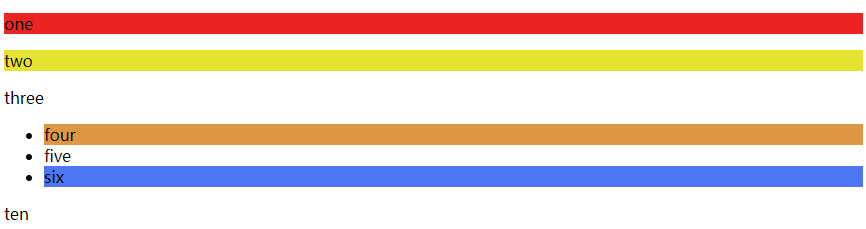

# 1.简介

### 1.1定义

Cascading Style Sheet 层叠级联样式表

### 1.2历史

CSS1.0

CSS2.0   DIV(块) + CSS, html与CSS结构分离的思想，网页变的简单了，SEO（Search Engine Optimization）搜索引擎优化

CSS2.1  浮动，定位

CSS3.0 圆角，阴影，动画

### 1.3特点

1.内容和表现分离

2.网页结构表现统一，方便复用

3.样式丰富

### 1.4css的三种导入方式

```html
<!--方式一-->
<h1 style="color: red">title</h1>
<!--方式二-->
<style>
    h1{
        color:green;
    }
</style>
<!--方式三-->
<link rel="stylesheet" href="css/style.css">
<!--优先级：就近原则-->
```

# 2.选择器

作用：选择页面上的某一个或者某一类元素

### 2.1基本选择器

- 标签选择器(==标签名==)

```html
<!DOCTYPE html>
<html lang="en">
<head>
    <meta charset="UTF-8">
    <title>Title</title>

    <style>
        /*标签选择器，会选择到页面上所有的这个标签的元素*/
        h1{
            color: aqua;
            background: azure;
            border-radius: 10px;
        }
        p{
            font-size: 80px;
        }
    </style>
</head>
<body>
<h1>title</h1>
<p>article</p>
</body>
</html>
```

- 类选择器（==.class{}==）

```html
<!DOCTYPE html>
<html lang="en">
<head>
    <meta charset="UTF-8">
    <title>Title</title>

    <style>
        /*类选择器  .class名称{}
        可以多个标签归类，复用
        */
        .one{
            color: aquamarine;
        }
        .two{
            color: peru;
        }
    </style>
</head>
<body>
<h1 class="one">title1</h1>
<h2 class="two">title2</h2>
<h3 class="two">title3</h3>
<p>article</p>
</body>
</html>
```


- id选择器（==#id{}==）

```html
<!DOCTYPE html>
<html lang="en">
<head>
    <meta charset="UTF-8">
    <title>Title</title>

    <style>
        /*id选择器  #名称{}
        id必须保证唯一
        */
        #one{
            color: aquamarine;
        }
        .two{
            color: peru;
        }
    </style>
</head>
<body>
<h1 id="one">title1</h1>
<h2 class="two">title2</h2>
<h3 class="two">title3</h3>
<p>article</p>
</body>
</html>
```

优先级：==id>class>标签==

### 2.2层次选择器

- 后代选择器

```html
body p{
	background:rebeccapurple;
}
```

- 子选择器

```html
body>p{
	background:rebeccapurple;
}
```

- 相邻兄弟选择器

```html
.active +p{
	background:rebeccapurple;
}
```


- 通用选择器

```
.active ~p{
		   background:rebeccapurple;
}
```

例子：

```html
<!DOCTYPE html>
<html lang="en">
<head>
    <meta charset="UTF-8">
    <title>Title</title>

    <style>
        /*后代选择器  选择body下的所有p标签*/
       body p{
            background: #d2b0f3;
        }
        /*子选择器 选择body下的p标签(只有一代)*/
       body>p{
           background:rebeccapurple;
       }
       /*相邻兄弟选择器  只有一个 向下相邻*/
       .active +p{
           background: aquamarine;
       }
       /*通用选择器  当前选中的元素向下的所有同级兄弟元素*/
       .active~p{
           background: #b19471;
       }
    </style>
</head>
<body>
<p>one</p>
<p>two</p>
<p class="active">three</p>
<ui>
    <li><p>four</p>
    </li>
    <li><p >five</p>
    </li>
    <li><p>six</p>
    </li>
</ui>
<p>ten</p>
</body>
</html>
```

### 2.3结构伪类选择器

```css
/*选择第一个标签*/
ul li:first-child{
    background: #de9742;
}
/*选择最后一个标签*/
ul li:last-child{
    background: #4d76f3;
}
/*选择当前父标签的第一个p标签*/
p:nth-child(1){
    background: #ec2323;
}
/*选择当前父标签的p标签中的第二个*/
p:nth-of-type(2){
    background: #e3e330;
}
```



### 2.4属性选择器

```css
/*a标签中id为name的元素变为红色*/
a[id="name"]{
	background:red;
}

/*a标签中class为link的元素变为黄色*/
a[class="link"]{
	background:yellow;
}


/*a标签中以以特定字符串str开头的元素*/
a[id^="str"]{
	background:yellow;
}

/*a标签中以以特定字符串str结尾的元素*/
a[id$="str"]{
	background:yellow;
}
```

# 3.样式

### 3.1字体样式

- 颜色（color）
- 字体（font-family）
- 大小（font-size）
- 粗细（font-weights）

### 3.2文本样式

- 颜色(color,rgb,rgba)
- 文本对齐的方式（text-align = center）
- 首行缩进（text-indent）
- 行高(line-height)
- 装饰(text-decoration)
- 文本图片水平对齐（vertical-align:middle）

### 3.3超链接伪类

```css
/* 默认的状态*/
a{
    text-decoration:none;
    color:#000;
}
/*鼠标悬停状态*/
a:hover{
    color:orange;
    font-size:30px;
}
```

### 3.4列表

```css
/*list-style:
	none:无
	cicle:原型
	decimal:数字
	square:正方形
*/
```

# 4.盒子模型

### 4.1参数

**margin**：外边距

**padding**：内边距

**border**：边框

### 4.2盒子大小计算

margin+border+padding+内容大小

### 4.3圆角边框

```css
border-radius:顺时针方向，从左上开始
```

# 5浮动

### 5.1标准文档流

块级元素：独占一行（h,p,div）

行内元素：在一行内（span,a,img）

### 5.2 display

```css
/*display:inline-block(块级+行内)
		block（块级）
		inline（行内）
		none
*/
```

### 5.3float

```css
/*float:right
		left
*/
```

### 5.4父级边框塌陷

- 增加父级元素高度（理论上无限高就不会出现这种情况）
- 增加一个空的div标签
- overflow
- 父类添加一个伪类

```css
#father : after{
    context：'';
    display:block;
    clear:both;
}
```

# 6定位

### 6.1相对定位

==position：relative;(上下左右)==

相对于**原来的位置**进行偏移，不会脱离标准文档流

### 6.2绝对定位

==position:absolute==

1.没有父级元素定位的前提下，相对于浏览器定位

2.假设父级元素存在定位（position：relative），通常会相对于父级元素进行偏移

3.在父级元素范围内移动

### 6.3 固定定位

==position:fixed==

### 6.4 z-index（堆叠）

默认是0，最高无限
