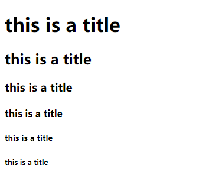
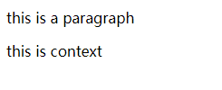
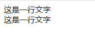
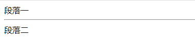
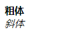
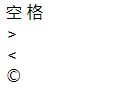
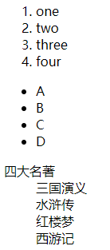
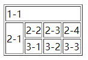
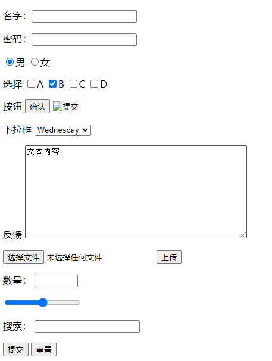

# 1. 简介

HTML(Hyper Text Markup Language)

### 1.1定义

超文本标记语言，通过标记符号来标记网页中的各个部分。

### 1.2特点

- 简易性

- 可扩展性
- 平台无关性（可以在大多数设备上使用）
- 通用性（兼容市面上的大部分浏览器）

# 2. 标签

### 2.1 基本标签

- 标题标签

```html
<h1>this is a title</h1>
<h2>this is a title</h2>
<h3>this is a title</h3>
<h4>this is a title</h4>
<h5>this is a title</h5>
<h6>this is a title</h6>
```



标题标签共6级，等级越高字体越小

- 段落标签

```html
<p>this is a paragraph</p>
<p>this is context</p>
```



用于文字之间的分段，如果不加<p>标签，文字会黏在一起，影响用户体验。

- 换行标签

```html
这是一行文字<br/>
这是一行文字
```



用于文字间的换行，与<p>标签的区别：

​		段落标签的行间距比换行标签的行间距大

​		段落标签是块元素，换行标签是行元素

- 水平线标签

```html
段落一
<hr/>
段落二
```



- 字体样式标签

```html
<strong>粗体</strong><br/>
<em>斜体</em>
```



- 注释和特殊符号

```html
<!--这是注释-->
<!--
特殊符号公式
   &+单词;
-->
	<!--空格-->
    空&nbsp;格<br/>
	<!-->-->
    &gt;<br/>
	<!--<-->
    &lt;<br/>
	<!--版权符-->
    &copy;
```



### 2.2图像标签(src)

```html
<!--src:图像地址
	alt:若图像无法加载，替代的文字
	title:鼠标悬停上显示的文字
	width:图像宽度
	height:图像高度
	ps.相对路径：../ --上一级目录
-->

```


### 2.3超链接(a)

```html
<!--
	path:链接地址（跳转到哪个位置）
	target:表示窗口打开的方式（_self:当前页面/_blank:新页面）
-->
<a href="path" target="">链接文本或图像</a>


<!--锚链接
1.需要一个锚标记（跳转到的地方）
2.跳转到标记
-->
<!--写在HTML顶部-->
<a name="top">顶部</a>
<!--中部或底部-->
<a href="#top">回到顶部</a>

<!--功能性链接
	邮件链接:mailto
	QQ链接
-->

```

### 2.4列表（ol/ul/dl）

```html
<!--有序列表-->
<ol>
    <li>one</li>
    <li>two</li>
    <li>three</li>
    <li>four</li>
</ol>
<!--无序列表-->
<ul>
    <li>A</li>
    <li>B</li>
    <li>C</li>
    <li>D</li>
</ul>
<!--自定义列表
dl:标签
dt:列表名称
dd:列表内容
-->
<dl>
    <dt>四大名著</dt>
    <dd>三国演义</dd>
    <dd>水浒传</dd>
    <dd>红楼梦</dd>
    <dd>西游记</dd>
</dl>
```



### 2.5表格(table)

```html
<!--表格
	tr:行
	td:列
	border:边框宽度
	colspan:跨列
	rowspan:跨行
-->
<table border="1px">
    <tr>
        <td colspan="4">1-1</td>
      
    </tr>
    <tr>
        <td rowspan="2">2-1</td>
        <td>2-2</td>
        <td>2-3</td>
        <td>2-4</td>
    </tr>
    <tr>
        <td>3-1</td>
        <td>3-2</td>
        <td>3-3</td>
    </tr>
</table>
```



### 2.6视频和音频(video/audio)

```html
<!--多媒体资源
	src:资源路径
	controls:控制台
	autoplay:自动播放
-->
<video src="" controls autoplay></video>
<audio src="" controls autoplay></audio>
```

==网页页面结构==

| 元素名  |       描述       |
| ------- | :--------------: |
| header  |       头部       |
| footer  |       脚部       |
| section | 页面中的独立区域 |
| article |  独立的文章内容  |
| aside   |      侧边栏      |
| nav     |      导航条      |

==iframe内联框架==

```html
<!--在网页的当前页面中打开一个小窗-->
<!--
src:小窗的地址
width:宽度
height:高度
name:名称
-->
<iframe src="" width="" height="" name="">
```


# 3. 表单（from）

```html

<!--表单的属性
action：表单提交请求的网址url
method:表单的提交方式（post/get）
name:表单的名称
-->
<!--表单的元素
type:类型（必须）
name:名称（必须）
value：默认初始值
maxlength:最长字符数
size:文本框的长度
readonly:只读
disabled:禁用
hidden:隐藏
-->
<from method="get"  name="Login" action="#" >
    <!--文本框-->
    <p>名字：<input type="text" name="username"/></p>
    <p>密码：<input type="password" name="pwd"/></p>
    <!--单选按钮
	checked：默认选中
-->
    <p>
        <input type="radio" value="男" name="sex" checked/>男
        <input type="radio" value="女" name="sex"/>女
    </p>
    <!--复选按钮-->
    <p>选择
        <input type="checkbox" value="A" name="check">A
        <input type="checkbox" value="B" name="check" checked>B
        <input type="checkbox" value="C" name="check">C
        <input type="checkbox" value="D" name="check">D
    </p>
    <!--按钮
	src：图片的路径
-->
    <p>按钮
        <input type="button" name="btn1" value="确认">
        <input type="image" src="图片的路径()">
    </p>
    <!--下拉框
	selected:默认选中
-->
    <p>下拉框
        <select name="list_name">
            <option value="Monday">Monday</option>
            <option value="Tuesday">Tuesday</option>
            <option value="Wednesday" selected>Wednesday</option>
            <option value="Thursday">Thursday</option>
            <option value="Friday">Friday</option>
            <option value="Saturday">Saturday</option>
            <option value="Sunday">Sunday</option>
        </select>
    </p>
    <!--文本域
	cols:列
	rows:行
-->
    <p>反馈
        <textarea name="textarea" cols="50" rows="10">文本内容</textarea>
    </p>
    <p>
       <input type="file" name="files">
       <input type="button" value="上传" name="upload">
    </p>
    <!--数字域
	max:最大值
	min:最小值
	step:步长
-->
    <p>数量：
        <input type="number" name ="num" max="100" min="10" step="1">
    </p>
    <!--滑块
	max:最大值
	min:最小值
	step:步长
-->
    <p>
        <input type="range" name="voice" min="0" max="100" step="1">
    </p>
    <!--搜索框-->
   <p>搜索：
       <input type="search" name="search">
    </p>
    <p>
        <input type="submit">
        <input type="reset">
    </p>
</from>
```



### 3.1表单的验证

- placeholder 提示信息
- required      不能为空
- pattern  正则


