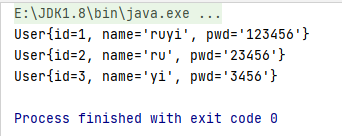
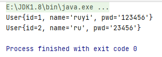
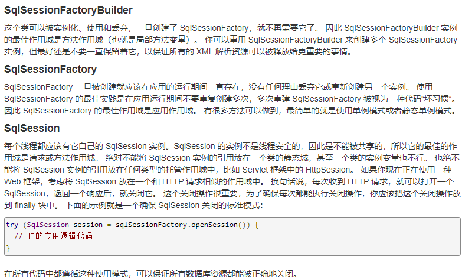
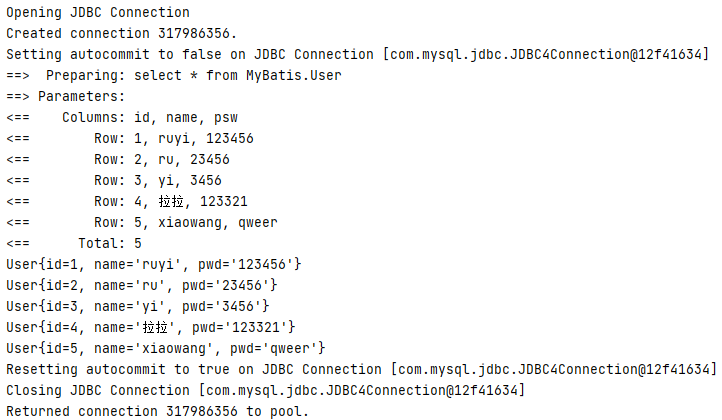
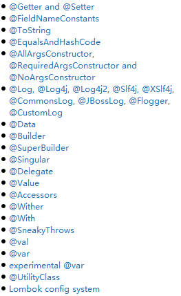
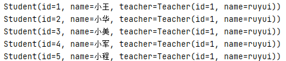
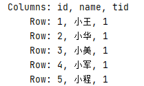
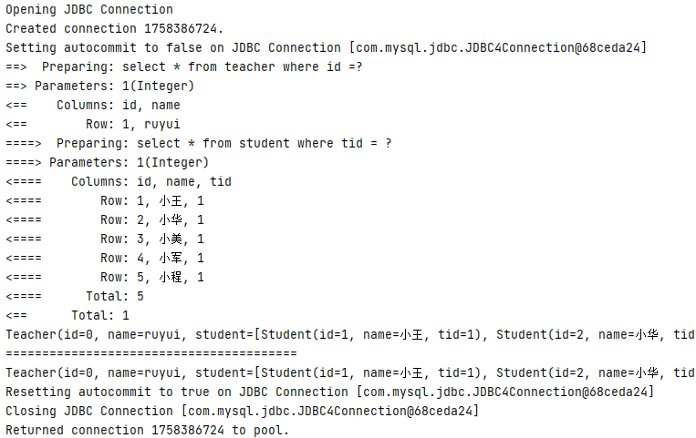

# MyBatis


官网：https://mybatis.org/mybatis-3/zh/index.html

Github:https://github.com/mybatis

Maven:https://mvnrepository.com/search?q=mybatis

### 1.简介

##### 1.1什么是MyBatis

- MyBatis 是一款优秀的**持久层框架**。它支持自定义 SQL、存储过程以及高级映射。

- MyBatis 免除了几乎所有的 JDBC 代码以及设置参数和获取结果集的工作。

- MyBatis 可以通过简单的 **XML** 或**注解**来配置和映射原始类型、接口和 Java POJO（Plain Old Java Objects，普通老式 Java 对象）为数据库中的记录。

- 原本为apache下产品，后迁移至goole，现已经迁移至Github。

##### 1.2 持久层

数据持久化

- 持久化就是将程序的数据在持久过程和瞬时过程转化的过程
- 内存==断电即失==
- 数据库，io文件（记事本）

##### 1.3持久层

Dao层，Service层，Controller层。。。

- 完成持久化的代码块
- 层与层之间界限明确
- 每层执行自己的功能

##### 1.4为什么用MyBatis

- 加快开发效率，方便
- 将数据存入数据库中
- 优点：
  - 简单
  - 灵活
  - sql与代码分离，提高可维护性
  - 提供映射标签，支持对象（pojo类）与数据库的orm字段关系映射
  - 提供对象关系映射标签，支持对象关系组件维护
  - 提供xml标签，支持编写动态sql

### 2.入门

##### 2.1搭建环境

> 创建数据库

```sql
CREATE DATABASE `MyBatis`;

USE `MyBatis`;
-- 创建表格：
-- 字段名 字段类型 限制（主键，非空，默认值）
CREATE TABLE `User`(
	`id` INT(10) NOT NULL PRIMARY KEY,
	`name` VARCHAR(20) DEFAULT NULL,
	`psw` VARCHAR(20) DEFAULT NULL
)ENGINE = INNODB DEFAULT CHARSET =utf8;

INSERT INTO `User`(id,`name`,`psw`) VALUES (1,'ruyi','123456'),
					    (2,'ru','23456'),
					    (3,'yi','3456')
```

>创建Maven项目

配置pom.xml文件

```xml
<?xml version="1.0" encoding="UTF-8"?>
<project xmlns="http://maven.apache.org/POM/4.0.0"
         xmlns:xsi="http://www.w3.org/2001/XMLSchema-instance"
         xsi:schemaLocation="http://maven.apache.org/POM/4.0.0 http://maven.apache.org/xsd/maven-4.0.0.xsd">
    <modelVersion>4.0.0</modelVersion>

    <groupId>org.example</groupId>
    <artifactId>Mybatis</artifactId>
    <version>1.0-SNAPSHOT</version>

    <properties>
        <maven.compiler.source>8</maven.compiler.source>
        <maven.compiler.target>8</maven.compiler.target>
    </properties>
    <!--导入依赖-->
    <dependencies>
        <!--mysql依赖-->
        <dependency>
            <groupId>mysql</groupId>
            <artifactId>mysql-connector-java</artifactId>
            <version>5.1.47</version>
        </dependency>
        <!--mybatis依赖-->
        <dependency>
            <groupId>org.mybatis</groupId>
            <artifactId>mybatis</artifactId>
            <version>3.4.6</version>
        </dependency>
        <!--junit依赖-->
        <dependency>
            <groupId>junit</groupId>
            <artifactId>junit</artifactId>
            <version>4.12</version>
            <scope>test</scope>
        </dependency>
    </dependencies>
</project>
```

##### 2.2编写代码

配置文件 mybatis_config.xml

```xml
<?xml version="1.0" encoding="UTF-8" ?>
<!DOCTYPE configuration
        PUBLIC "-//mybatis.org//DTD Config 3.0//EN"
        "https://mybatis.org/dtd/mybatis-3-config.dtd">
<!--数据库参数的设置-->
<configuration>
    <environments default="development">
        <environment id="development">
            <transactionManager type="JDBC"/>
            <dataSource type="POOLED">
                <property name="driver" value="com.mysql.jdbc.Driver"/>
                <property name="url" value="jdbc:mysql://localhost:3306/MyBatis?useSSL=false&amp;useUnicode=true&amp;characterEncoding=utf-8"/>
                <property name="username" value="root"/>
                <property name="password" value="123456"/>
            </dataSource>
        </environment>
    </environments>
    <!--绑定mapper-->
    <mappers>
        <mapper resource="com/ruyi/dao/UserMapper.xml"/>
    </mappers>
</configuration>
```

编写Mybatis工具类

```java
package com.ruyi.util;

import org.apache.ibatis.io.Resources;
import org.apache.ibatis.session.SqlSession;
import org.apache.ibatis.session.SqlSessionFactory;
import org.apache.ibatis.session.SqlSessionFactoryBuilder;

import java.io.IOException;
import java.io.InputStream;

public class MyBatisUtils {
    public static SqlSessionFactory sqlSessionFactory;
    static {
        try {
            String resource = "MyBatis_config.xml";
            //读取xml文件
            InputStream inputStream = Resources.getResourceAsStream(resource);
            //构造sqlSessionFactory
            SqlSessionFactory sqlSessionFactory = new SqlSessionFactoryBuilder().build(inputStream);
        }catch(IOException e){
            e.printStackTrace();
        }
    }

    public static SqlSession getSqlSession(){
        return sqlSessionFactory.openSession();
    }
}

```

pojo实体类

```java
package com.ruyi.pojo;

public class User {
    private int id;
    private String name;
    private String pwd;

    public User(int id, String name, String pwd) {
        this.id = id;
        this.name = name;
        this.pwd = pwd;
    }

    public int getId() {
        return id;
    }

    public String getName() {
        return name;
    }

    public String getPwd() {
        return pwd;
    }

    public void setId(int id) {
        this.id = id;
    }

    public void setName(String name) {
        this.name = name;
    }

    public void setPwd(String pwd) {
        this.pwd = pwd;
    }
    
    @Override
    public String toString() {
        return "User{" +
                "id=" + id +
                ", name='" + name + '\'' +
                ", pwd='" + pwd + '\'' +
                '}';
    }
}

```

Dao层（User接口）

```java
package com.ruyi.dao;

import com.ruyi.pojo.User;

import java.util.List;

public interface UserDao {
    List<User> getUserList();
}

```

接口实现类（UserMapper.xml）

```xml
<?xml version="1.0" encoding="UTF-8" ?>
<!DOCTYPE mapper
        PUBLIC "-//mybatis.org//DTD Mapper 3.0//EN"
        "https://mybatis.org/dtd/mybatis-3-mapper.dtd">
<!-- 绑定Mapper-->
<mapper namespace="com.ruyi.dao.UserDao">
    <!--查询语句
		id:方法名
		resultTYpe:返回值类型
		parameterType:参数类型
	-->
    <select id="getUserList" resultType="com.ruyi.pojo.User">
        select * from MyBatis.User
    </select>
</mapper>
```

测试

==注意==：Maven的约定大于配置，我们写的配置文件（.xml文件）可能无法导出，需要手动配置

```xml
<build>
    <resources>
        <resource>
            <directory>src/main/resources</directory>
            <includes>
                <include>**/*.properties</include>
                <include>**/*.xml</include>
            </includes>
        </resource>

        <resource>
            <directory>src/main/java</directory>
            <includes>
                <include>**/*.properties</include>
                <include>**/*.xml</include>
            </includes>
        </resource>

    </resources>
</build>
```

```java
package com.ruyi.dao;
import com.ruyi.pojo.User;
import com.ruyi.util.MyBatisUtils;
import org.apache.ibatis.session.SqlSession;
import org.junit.Test;

import java.util.List;

public class UserDaoTest {
    @Test
    public void test(){
        SqlSession sqlSession = MyBatisUtils.getSqlSession();
        UserDao userDao = sqlSession.getMapper(UserDao.class);
        List<User> userList = userDao.getUserList();
        
        for(User user: userList){
            System.out.println(user);
        }
        //关闭sqlSession连接，释放资源
        sqlSession.close();
    }
}

```



可能会遇到的问题：

- 配置文件没有注册（<mapper resource="com/ruyi/dao/UserMapper.xml"/>）
- 绑定接口错误
- 方法名不对（方法名与id一致）
- 返回类型不对（查询一般为自己创建的实体类对象，增删改为int）
- Maven导出资源问题（自己写的配置文件无法导出，解决方法在上面）
- com.mysql.jdbc.exceptions.jdbc4.CommunicationsException: Communications link failure（与use SSL有关）

==关于useSSL==

useSSL是干什么？useSSL=false和useSSL=true的区别？

- 简单的说useSSL是连接数据库的通道，在MySQL的高版本中我们需要说明标注useSSL=false还是useSSL=true。
- 而目前设置useSSL=false是最好的解决方案，在MySQL5.7后官方对数据库连接池提高了要求，之前设置useSSL=true也是可以运行的。
- 设置useSSL=false为显式禁用SSL，设置useSSL=true为服务器证书验证提供信任存储。所以只要将==useSSL=false==就解决了问题。


### 3.CURD(增删改查)

##### 3.1Select

- id:对应namespace（Dao实现类）中的方法名
- resultType:返回值类型
- parameterType：参数类型

test(测试)

```java
 @Test
    public void test2(){
        ///获取sqlSession
        SqlSession sqlSession = MyBatisUtils.getSqlSession();
        //获取关系映射，将sqlSession与具体的类绑定
        UserDao userDao = sqlSession.getMapper(UserDao.class);
        //实现类中的方法
        User user = userDao.getNameById(1);
        System.out.println(user);
        sqlSession.close();
    }
```

UserMapper.xml

```xml
<select id="getNameById" resultType="com.ruyi.pojo.User">
    select * from MyBatis.User where id =#{id}
</select>
```

interface(接口)

```java
//查询
User getNameById(int id);
```

##### 3.2Insert（需要提交事务）

interface(接口)

```java
//插入
int insertContext(User user);
```

UserMapper.xml

```xml
<insert id="insertContext" parameterType="com.ruyi.pojo.User">
    insert into MyBatis.User(id,name,psw) values (#{id},#{name},#{psw})
</insert>
```

测试

```java
@Test
public void test3(){
    SqlSession sqlSession = MyBatisUtils.getSqlSession();
    UserDao userDao = sqlSession.getMapper(UserDao.class);
    int user = userDao.insertContext(new User(4,"兮兮","123321"));
    //提交事务
    sqlSession.commit();
    sqlSession.close();
}
```

##### 3.3Update（需要提交事务）

interface(接口)

```java
//修改
int updateContext(User user);
```

UserMapper.xml

```xml
<update id="updateContext" parameterType="com.ruyi.pojo.User">
    update MyBatis.User set `name`=#{name},psw=#{psw} where id=#{id};
</update>
```

测试

```java
@Test
public void test4(){
    SqlSession sqlSession = MyBatisUtils.getSqlSession();
    UserDao userDao = sqlSession.getMapper(UserDao.class);
    int user = userDao.updateContext(new User(4,"拉拉","123321"));
    sqlSession.commit();
    sqlSession.close();
}
```

##### 3.4Delete（需要提交事务）

interface(接口)

```java
//删除
int deleteById(int id);
```

UserMapper.xml

```xml
<delete id="deleteById" parameterType="int">
    delete from MyBatis.User where id =#{id}
</delete>
```

测试

```java
@Test
public void test5(){
    SqlSession sqlSession = MyBatisUtils.getSqlSession();
    UserDao userDao = sqlSession.getMapper(UserDao.class);
    int user = userDao.deleteById(4);
    sqlSession.commit();
    sqlSession.close();
}
```

##### 3.5Map

当数据库中的字段过多，而我们只想改变部分字段时，我们可以使用map。

接口

```java
//插入 two
int insertContext2(Map<String,Object> map);
```

UserMapper.xml

```xml
<!--Userid,Username,Userpassword为map中的键-->
<insert id="insertContext2" parameterType="map">
    insert into MyBatis.User(id,name,psw) values (#{Userid},#{Username},#{Userpassword})
</insert>
```

使用Map之后，value里面的词不需要和数据库中 的字段名对应。需要注意的是，Map中的key和这边value里面的值要一样，不然会插入空值！！！

测试

```java
@Test
public void test6(){
    SqlSession sqlSession = MyBatisUtils.getSqlSession();
    UserDao userDao = sqlSession.getMapper(UserDao.class);
    Map<String,Object> map = new HashMap<String,Object>();
    map.put("Userid",5);
    map.put("Username","xiaowang");
    map.put("Userpassword","qweer");
    userDao.insertContext2(map);
    sqlSession.commit();
    sqlSession.close();
}
```

Map传参，只需要在sql中取出key	parameterType="map"

对象传参，直接在sql中去对象的属性类型	parameterType="int"

##### 3.6模糊查询

查询数据库中含ru的用户

Dao

```java
//模糊查询
List<User> getLikeBy(Map<String,Object> map);
```

UserMapper.xml

```xml
<select id="getLikeBy" parameterType="map" resultType="com.ruyi.pojo.User">
select * from MyBatis.User where name like #{value}
</select>
```

test

```java
@Test
public void test7(){
    SqlSession sqlSession = MyBatisUtils.getSqlSession();
    UserDao userDao = sqlSession.getMapper(UserDao.class);
    Map<String,Object> map =new HashMap<String,Object>();
    map.put("value","%ru%");
    List<User> user = userDao.getLikeBy(map);
    for(User use: user){
        System.out.println(use);
    }
    sqlSession.close();
}
```

result:



### 4.配置解析

>configuration（配置）
>
>properties（属性）
>
>settings（设置）
>
>typeAliases（类型别名）
>
>typeHandlers（类型处理器）
>
>objectFactory（对象工厂）
>
>plugins（插件）
>
>environments（环境配置）
>
>environment（环境变量）
>
>transactionManager（事务管理器）
>
>dataSource（数据源）
>
>databaseIdProvider（数据库厂商标识）
>
>mappers（映射器）

##### 4.1环境配置

MyBatis 可以配置成适应多种环境（开发环境，测试环境），但每个 SqlSessionFactory 实例只能选择一种环境。


transactionManager（事务管理器）

- JDBC（默认）
- MANAGED


dataSource（数据源）

- UNPOOLED
- POOLED（默认）
- JNDI


##### 4.2属性（properties）

可以将数据库的一些基本配置（驱动，url,用户名，密码）写在配置文件中，通过配置文件中的properties导入

db.properties

```properties
driver =com.mysql.jdbc.Driver
url =jdbc:mysql://localhost:3306/MyBatis?useSSL=false&useUnicode=true&characterEncoding=utf-8
username =root
password =123456
```

MyBatis_config.xml

```xml
<?xml version="1.0" encoding="UTF-8" ?>
<!DOCTYPE configuration
        PUBLIC "-//mybatis.org//DTD Config 3.0//EN"
        "https://mybatis.org/dtd/mybatis-3-config.dtd">
<!--导入配置文件-->
<configuration>
    <properties resource="db.properties">
    </properties>
    <!--环境配置-->
    <environments default="development">
        <environment id="development">
            <transactionManager type="JDBC"/>
            <dataSource type="POOLED">
                <property name="driver" value="${driver}"/>
                <property name="url" value="${url}"/>
                <property name="username" value="${username}"/>
                <property name="password" value="${password}"/>
            </dataSource>
        </environment>
    </environments>

    <mappers>
        <mapper resource="com/ruyi/dao/UserMapper.xml"/>
    </mappers>
</configuration>
```

**tips:**

- 可以直接引入外部文件
- 可以在properties中增加一些属性配置（配置数据库驱动，url等）
- 如果两个文件有同一字段，优先使用外部配置文件的

##### 4.3别名（typeAliases）

类型别名可为 Java 类型设置一个缩写名字。 它仅用于 XML 配置，意在降低冗余的全限定类名书写。

方式一：

```xml
<!--type:原名
	alias：别名
-->
<typeAliases>
    <typeAlias type="com.ruyi.pojo.User" alias="user"/>
</typeAliases>
```

方式二：

```xml
<!--给该包名下的类起别名，别名为该实体类的名称
	如：com.ruyi.pojo.User  别名为user
-->
<typeAliases>
    <package name="com.ruyi.pojo"/>
</typeAliases>
```

- 如果使用方式二添加别名，别名为该实体类的名字，这里是user
- 方式一可以自定义别名，方式二也可以通过注解的方式（在实体类上添加注解）自定义别名

##### 4.4设置

**logImpl**

指定 MyBatis 所用日志的具体实现，未指定时将自动查找。

- SLF4J | LOG4J（3.5.9 起废弃） | LOG4J2 | JDK_LOGGING | COMMONS_LOGGING | STDOUT_LOGGING | NO_LOGGING


**cacheEnabled**

全局性地开启或关闭所有映射器配置文件中已配置的任何缓存（二级缓存）。

- true|false


**lazyLoadingEnabled**

延迟加载的全局开关。当开启时，所有关联对象都会延迟加载。 特定关联关系中可通过设置 fetchType 属性来覆盖该项的开关状态。

- true|false


##### 4.7映射器（mappers）

方式一：通过资源路径加载

```xml
<mappers>
    <mapper resource="com/ruyi/dao/UserMapper.xml"/>
</mappers>
```

方式二：使用class文件（类）绑定注册

```xml
<mappers>
    <mapper class="com.ruyi.dao.UserMapper"/>
</mappers>
```

==tips==:接口和他的Mapper配置文件必须同名

​		接口和他的Mapper配置文件必须在同一个包下

方式三：通过包名加载该包下的所有配置文件

```xml
<mappers>
    <package name="com.ruyi.dao"/>
</mappers>
```

##### 4.8作用域和生命周期



**SqlSessionFactoryBuilder—>SqlSessionFactory—>SqlSession**


**SqlSessionFactoryBuilder**

- 一旦创建了，就不再需要它了
- 最佳作用域是方法作用域（也就是局部方法变量）


 **SqlSessionFactory**

- 一旦被创建就应该在应用的运行期间一直存在
- 最佳作用域是应用作用域(程序开启时开启，程序关闭时关闭)
- 使用**单例模式**或者**静态单例模式**


**SqlSession**

- 最佳的作用域是请求或方法作用域
- 每次收到 HTTP 请求，就可以打开一个 SqlSession，响应结束时关闭
- 每个HTTP请求或者线程独享一个sqlSession


### 5.属性名和字段名不一致

**解决方法**

- 在sql中给字段起别名（从sql的层面解决）
- 结果集映射（在配置文件中解决）

```xml
<resultMap id="UserMap" type="User">
    <!--数据库中的column与pojo中的property对应-->
    <result column="name" property="name"/>
    <result column="psw" property="pwd"/>
</resultMap>

<select id="getUserList" resultMap="UserMap">
    select * from MyBatis.User
</select>
```

### 6.日志

##### 6.1日志工厂

数据库操作排错

- STDOUT_LOGGING（自带的日志）

```xml
<settings>
    <setting name="logImpl" value="STDOUT_LOGGING"/>
</settings>
```



- LOG4J(需要导包)

```xml
<dependency>
    <groupId>log4j</groupId>
    <artifactId>log4j</artifactId>
    <version>1.2.17</version>
</dependency>
```

log4j.properties

```properties
#将等级为DEBUG的日志信息输出到console和file这两个目的地，console和file的定义在下面的代码
log4j.rootLogger=DEBUG,console,file

#控制台输出的相关设置
log4j.appender.console = org.apache.log4j.ConsoleAppender
log4j.appender.console.Target = System.out
log4j.appender.console.Threshold=DEBUG
log4j.appender.console.layout = org.apache.log4j.PatternLayout
log4j.appender.console.layout.ConversionPattern=[%c]-%m%n

#文件输出的相关设置
log4j.appender.file = org.apache.log4j.RollingFileAppender
log4j.appender.file.File=./log/kuang.log
log4j.appender.file.MaxFileSize=10mb
log4j.appender.file.Threshold=DEBUG
log4j.appender.file.layout=org.apache.log4j.PatternLayout
log4j.appender.file.layout.ConversionPattern=[%p][%d{yy-MM-dd}][%c]%m%n

#日志输出级别
log4j.logger.org.mybatis=DEBUG
log4j.logger.java.sql=DEBUG
log4j.logger.java.sql.Statement=DEBUG
log4j.logger.java.sql.ResultSet=DEBUG
log4j.logger.java.sql.PreparedStatement=DEBUG
```

配置

```xml
<settings>
    <setting name="logImpl" value="LOG4J"/>
</settings>
```

### 7分页

- limit分页

接口

```java
//分页
List<User> getUserLimit(Map<String,Integer> map);
```

UserMapper.xml

```xml
<!--startIndex:从哪个位置开始
	pageSize:每页的记录条数
-->
<select id="getUserLimit" parameterType="map" resultType="user">
    select * from MyBatis.User limit #{startIndex},#{pageSize}
</select>
```

测试

```java
@Test
public void test8(){
    SqlSession sqlSession = MyBatisUtils.getSqlSession();
    UserMapper mapper = sqlSession.getMapper(UserMapper.class);
    Map<String,Integer> map=new HashMap<String,Integer>();
    map.put("startIndex",1);
    map.put("pageSize",3);
    List<User> list = mapper.getUserLimit(map);
    for(User user: list){
        System.out.println(user);
    }
    sqlSession.close();
}
```

- RowBounds分页（了解）

- 第三方分页插件

### 8.使用注解开发

```java
@Select("select * from MyBatis.User")
List<User> getUserList();
```

查询

```java
@Select("select * from User where id=#{id}")
User getNameById(@Param("id") int id);
```

插入

```java
@Insert("insert into User(id,name,psw) values (#{id},#{name},#{psw})")
int insertContext(User user);
```

==tips==

适合简单的增删改查sql，复杂的sql还是推荐通过mapper去编写。

### 9.Lombok

- 在IDEA中下载Lombok插件



- 在项目中导入lombok jar包

```xml
<dependency>
    <groupId>org.projectlombok</groupId>
    <artifactId>lombok</artifactId>
    <version>1.18.12</version>
</dependency>
```


**经常使用的**：

```java
@Data	get,set,toString
@AllArgsConstructor  有参构造
@NoArgsConstructor	 无参构造
```


### 10.多对一&一对多

- 多个学生，对应一个老师
- 对于学生，多个学生关联一个老师（关联）==多对一==
- 对于老师，一个老师有很多学生（集合） ==一对多==


example

**多对一**(从学生的角度)

- 数据库

```sql
CREATE TABLE `Teacher`(
	`id` INT(10)  PRIMARY KEY NOT NULL,
	`name` NVARCHAR(20)  DEFAULT NULL
)ENGINE = INNODB DEFAULT CHARSET =utf8;

INSERT INTO teacher(id,`name`) VALUES (1,"ruyui")


CREATE TABLE `Student`(
	`id` INT(10)  PRIMARY KEY NOT NULL,
	`name` NVARCHAR(20)  DEFAULT NULL,
	`tid` INT(10) DEFAULT NULL,
	KEY `fktid` (`tid`),
	CONSTRAINT `fktid` FOREIGN KEY (`tid`) REFERENCES `teacher` (`id`)
)ENGINE = INNODB DEFAULT CHARSET =utf8;


INSERT INTO `Student` (id,`name`,tid) VALUES (1,"小王",1);
INSERT INTO `Student` (id,`name`,tid) VALUES (2,"小华",1);
INSERT INTO `Student` (id,`name`,tid) VALUES (3,"小美",1);
INSERT INTO `Student` (id,`name`,tid) VALUES (4,"小军",1);
INSERT INTO `Student` (id,`name`,tid) VALUES (5,"小程",1);
```

- pojo类

```java
package com.ruyi.pojo;

import lombok.AllArgsConstructor;
import lombok.Data;
import lombok.NoArgsConstructor;

@Data
@AllArgsConstructor
@NoArgsConstructor
public class Student {
    private int id;
    private String name;
    private Teacher teacher;
}


package com.ruyi.pojo;

import lombok.AllArgsConstructor;
import lombok.Data;
import lombok.NoArgsConstructor;

@Data
@AllArgsConstructor
@NoArgsConstructor
public class Teacher {
    private int id;
    private String name;

}

```

- Mapper接口

```java
package com.ruyi.dao;

import com.ruyi.pojo.Teacher;
import org.apache.ibatis.annotations.Select;

public interface TeacherMapper {
    @Select("select * from teacher where id =#{id}")
    Teacher getTeacherInfo(int id);
}

```

- 接口绑定	==注意：使用注解开发只能用class绑定接口==

```xml
<mappers>
    <mapper class="com.ruyi.dao.TeacherMapper"/>
    <mapper class="com.ruyi.dao.StudentMapper"/>
</mappers>
```

- StudentMapper.xml

```xml
<!--方式一：嵌套查询（子查询）-->
<select id="getStudentInfo" resultMap="stu_tea">
    select * from student
</select>
<resultMap id="stu_tea" type="Student">
    <association property="teacher" column="tid" javaType="Teacher" select="getTeacherInfo"/>
</resultMap>
<select id="getTeacherInfo" resultType="teacher">
    select * from teacher where id =#{id}
</select>

<!--方式二：按照结果查询（连表查询）-->
<select id="getStudentInfo2" resultMap="stu_tea2">
    select s.id sid,s.name sname,t.name tname
    from student s,teacher t
    where s.tid = t.id;
</select>
<resultMap id="stu_tea2" type="Student">
    <result property="id" column="sid"/>
    <result property="name" column="sname"/>
    <association property="teacher" javaType="Teacher">
        <result property="name" column="tname"/>
    </association>
</resultMap>
```

- 测试

```java
@Test
public void t2(){
    SqlSession sqlSession = MyBatisUtils.getSqlSession();
    StudentMapper studentmapper = sqlSession.getMapper(StudentMapper.class);
    List<Student> list = studentmapper.getStudentInfo();
    for (Student stu:list)
        System.out.println(stu);
    sqlSession.close();
}

@Test
public void t3(){
    SqlSession sqlSession = MyBatisUtils.getSqlSession();
    StudentMapper studentmapper = sqlSession.getMapper(StudentMapper.class);
    List<Student> list = studentmapper.getStudentInfo2();
    for (Student stu:list)
        System.out.println(stu);
    sqlSession.close();
}
```

**output:**




**一对多**（从老师的角度）

- TeacherMapper.xml

```xml
<!--方式一：按结果查询-->
<select id="getTeacherinfo2" resultMap="tea_stu">
    select s.id sid,s.name sname,t.name tname,t.id tid
    from student s,teacher t
    where s.tid = t.id and t.id = ${id}
</select>
<resultMap id="tea_stu" type="Teacher">
    <result property="id" column="tid"/>
    <result property="name" column="tname"/>
    <collection property="student" ofType="Student">
        <result property="id" column="sid"/>
        <result property="name" column="sname"/>
    </collection>
</resultMap>

<!--方式二：嵌套查询-->
<select id="getTeacherInfo" resultMap="tea_stu2">
    select * from teacher where id =#{id}
</select>
<resultMap id="tea_stu2" type="Teacher">
    <collection property="student" javaType="ArrayList" ofType="Student" select="getStudentById" column="id">
    </collection>
</resultMap>

<select id="getStudentById" resultType="Student">
    select * from student where tid = #{tid}
</select>
```

- 测试

```java
@Test
public void t4(){
    SqlSession sqlSession = MyBatisUtils.getSqlSession();
    TeacherMapper teachermapper = sqlSession.getMapper(TeacherMapper.class);
    Teacher teacherinfo2 = teachermapper.getTeacherinfo2(1);
    System.out.println(teacherinfo2);
    sqlSession.close();
}
@Test
public void t5(){
    SqlSession sqlSession = MyBatisUtils.getSqlSession();
    TeacherMapper teachermapper = sqlSession.getMapper(TeacherMapper.class);
    Teacher teacherInfo = teachermapper.getTeacherInfo(1);
    System.out.println(teacherInfo);
    sqlSession.close();
}
```

**output:**



==tips:==

- javaType&ofType
  - javaType用来指定实体类中的属性
  - ofType用来指定映射到List或者集合中的pojo类型，泛型中的约束类型

### 12.动态SQL

- if

当指定条件满足时，通过相应的sql语句查询

```xml
<select id="findActiveBlogLike"
     resultType="Blog">
  SELECT * FROM BLOG
  <where>
    <if test="state != null">
         state = #{state}
    </if>
    <if test="title != null">
        AND title like #{title}
    </if>
    <if test="author != null and author.name != null">
        AND author_name like #{author.name}
    </if>
  </where>
</select>
```


- choose (when, otherwise)

```xml
<!--类似java的switch case-->
<select id="findActiveBlogLike"
     resultType="Blog">
  SELECT * FROM BLOG 
  <where>
  <choose>
    <when test="title != null">
      AND title like #{title}
    </when>
    <when test="author != null and author.name != null">
      AND author_name like #{author.name}
    </when>
    <otherwise>
      AND featured = 1
    </otherwise>
  </choose>
    </where>
</select>
```


- trim (where, set)

更新字段时，只更新有数值变动的字段

```xml
<update id="updateAuthorIfNecessary">
  update Author
    <set>
      <if test="username != null">username=#{username},</if>
      <if test="password != null">password=#{password},</if>
      <if test="email != null">email=#{email},</if>
      <if test="bio != null">bio=#{bio}</if>
    </set>
  where id=#{id}
</update>
```

```xml
<trim prefix="WHERE" prefixOverrides="AND |OR ">
  ...
</trim>
```

```xml
<trim prefix="SET" suffixOverrides=",">
  ...
</trim>
```

- SQL片段

有的时候，我们可能会将一些功能代码抽取出来，方便复用

1.使用SQL标签抽取公共部分

2.在需要使用的地方使用include标签引用

==tips：==

最好作用在单表上

尽量不要加入where标签

- foreach

```xml
<!--
	item:遍历的值的名称
	collection：遍历数组的名称
	index：遍历数组的下标
	open:开始符号
	close:结束符号
	separator:分隔符
-->
<select id="selectPostIn" resultType="domain.blog.Post">
  SELECT *
  FROM POST P
  <where>
    <foreach item="item" index="index" collection="list"
        open="ID in (" separator="," close=")" nullable="true">
          #{item}
    </foreach>
  </where>
</select>
```

==tips==

随机ID产生

```java
public class IDUtils {
    public static String getId(){
        return UUID.randomUUID().toString().replaceAll("-","");
    }
}
```

### 13.缓存

##### 13.1简介

1.什么是缓存

- 存在内存中的临时数据
- 将用户经常查询的数据放在缓存中，用户查询数据不用去磁盘查询，直接从缓存读取，从而提高了查询效率，解决了高并发系统的性能问题

2.为什么使用缓存

- 减少和数据库交互的次数，减少系统开销，提高系统效率

3.什么样的数据适合缓存

- 经常查询不经常改变的数据

##### 13.2MyBatis缓存

MyBatis 内置了一个强大的事务性查询缓存机制，它可以非常方便地配置和定制。 为了使它更加强大而且易于配置，我们对 MyBatis 3 中的缓存实现进行了许多改进。

- 默认情况下，开启一级缓存

一级缓存也叫本地缓存（作用域：sqlSession），当sqlSession关闭时，缓存关闭。存储与数据库同一次会话期间查询到的数据，以后如果要获取同样的数据，直接从缓存中取。



sql语句只执行一次，第二次是从本地缓存中读取的


- 二级缓存的开启需要配置

二级缓存也叫全局缓存，用来增加缓存的作用域（作用域：namespace）

- 工作机制：
  - 一个会话查询一条数据，这个数据就会被放在当前会话的一级缓存中
  - 如果当前会话关闭，一级缓存会将其中的数据传给二级缓存
  - 不同的mapper查出来的数据会放在自己对应的缓存中


开启全局缓存

```xml
<setting name="cacheEnabled" value="true"/>
```

在当前mapper中开启缓存

```xml
<!--
eviction:缓存清理机制
	LRU – 最近最少使用：移除最长时间不被使用的对象。
	FIFO – 先进先出：按对象进入缓存的顺序来移除它们。
	SOFT – 软引用：基于垃圾回收器状态和软引用规则移除对象。
	WEAK – 弱引用：更积极地基于垃圾收集器状态和弱引用规则移除对象
flushInterval：缓存刷新时间
size:缓存大小
readOnly:只读
-->
<cache
  eviction="FIFO"
  flushInterval="60000"
  size="512"
  readOnly="true"/>
```

可能存在的问题：

实体类序列化（NotSerializableException）

##### 13.3自定义缓存（ehcache）

```xml
<dependency>
            <groupId>org.mybatis.caches</groupId>
            <artifactId>mybatis-ehcache</artifactId>
            <version>1.1.0</version>
        </dependency>
```

```xml
<cache type="org.mybatis.caches.ehcache.EhcacheCache"/>
```


