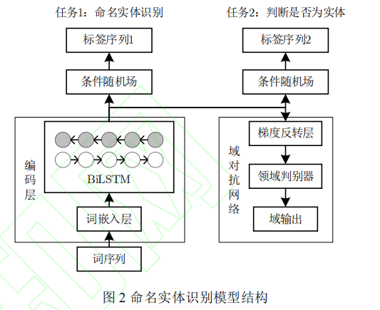

# 命名实体识别模型

BERT+softmax

BERT+BILSTM-CRF

BERT+span

BiLSTM-DANN-MTL

# 可能用到的文本预处理工具

- NLTK工具包

- TextBlob
- spacy
- Gensim
- CoreNLP

# 关于词嵌入（向量化）

https://zhuanlan.zhihu.com/p/170599824

# 一些现有的模型

https://github.com/tanlab/ConvolutionMedicalNer
