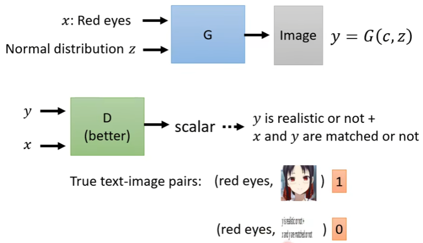

#### GAN(生成式对抗网络 Generative Adversarial Network)

**Application：**

生成（generate）如：生成漫画人物，GAN for Sequence Generation（GAN 生成句子）

风格迁移  如：现实人物-漫画人物

补全

**background**

同一种输入，可能存在不同的输出。这时候需要一个概率分布去决定是哪一种输出。即让机器有一定的创造力（creativity）。

如画图（drawing），聊天(charbot)，我们需要机器去主动生成一些东西。

无约束条件的生成（unconditional generation）

即网络输入一个分布，输出对应的图片

**如何判断生成器生成的图片是否是我们想要的呢？**

Discriminator（判别器）

将生成器生成的图片喂给判别器，判别器会打一个分数，分数越高说明越真实（1代表数据集中存在的真实的图片，0代表生成器的假图片。事先标注若干数据训练判别器）

**generator&discriminator**

generator主要的目标是以假乱真，想办法随机生成一张图或一段文字看起来就像真的一样。

discriminator主要的目标就是区分真假，尽可能区分出生成器生成的假图片和数据集中的真图片。

二者相互博弈，相互促进，最终生成器能够生成质量较高的图片。如果二者在博弈的过程中有一方选择妥协，那么结果将不会再变得更好。即判别器不再能判别真假图片时，图片的质量就会停在原地。生成器不成生成更高质量的图片时，判别器也无需进一步调整。

**Algorithm**

- **Step 1**:固定生成器，更新判别器

生成器不变，调整判别器的参数，使判别器能够区分数据集中的图片$P_{data}$和生成器生成的图片$P_G $

- **Step 2**:固定判别器，更新生成器

判别器不变，调整生成器的参数，使生成器能够生成更加逼近真实图片的$P_G$

- **Step 3**:多轮训练

循环多次，直到你认为生成器生成的图片已经足够真实了

==interpolation（插值）?==

**一些公式推导**：

因为现实生活中$P_{data}$无法用数学表达式表示，我们希望用一个式子$P_G$去无限接近它，因此我们设计一个Generator网络来生成$P_G$

Div   Divergence

对于判别器，我们希望得到最大化的V

$$V(G,D) = E_{x ~ P_{data}}[logD(x)] + E_{x ~ P_G}[log(1-D(x))]$$

对于生成器，我们希望得到最小的$G^*$，即$P_{data}$与$P_G$之间无限接近

一般使用wasserstein distance来衡量$P_{data}$与$P_G$之间的距离

穷举所有值，找到最小值作为wasserstein distance

1-Lipschitz代表光滑的函数，不光滑的函数可能会有Mode collapse问题

Gaussian Distribution（高斯分布）

**Evaluation GAN**

object:衡量generated的好坏

off-the-shelf image classifier(影响辨识分类)

给生成器生成的图片，判断该图片的类别

**可能会遇到的问题**

Mode collapse（模式坍塌）

生成器产生的结果很单一，即假样本太集中，不够均匀。

Mode dropping(多样性不够)  Diversity(针对一堆图片)   quality（针对一张图片）

生成器无法生成样本以外的数据

**评判指标**

Inception Score(IS)

FID(Frechet Inception Distance)

有约束的生成（conditional generation）

text-to-image(给一个文字，限定图片的类型)

image translation or pix2pix

图像风格转换（cycle GAN）

文字风格转换（text Style Transfer）
