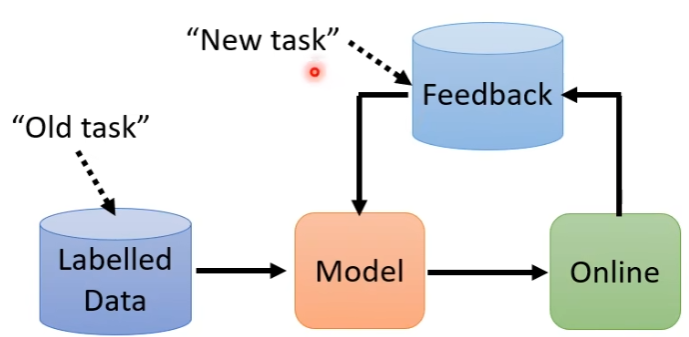
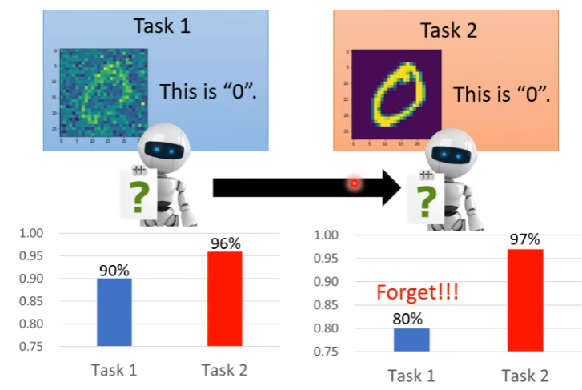
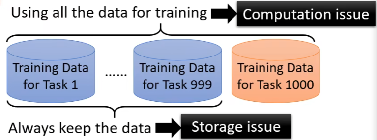
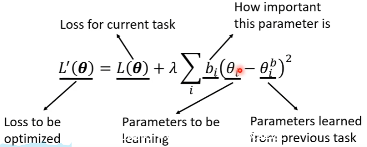
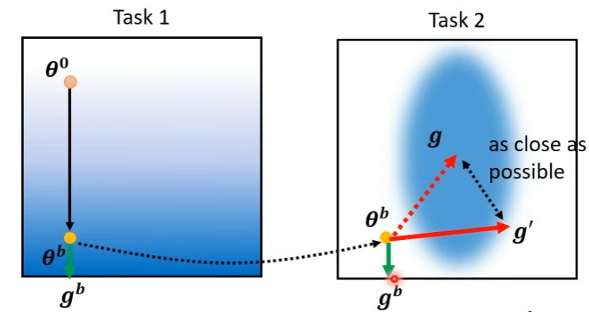

# life long learning

Life Long Learning(LLL),Continuous Learning,Never Ending Learning,Incremental Learning

**application**

==problem==

**Catastrophic Forgetting** 先让机器学习task1，机器即使不看task2的资料也能有高正确率。在学习task1的基础上再去学习task2，机器会忘记task1相关咨询。

==sovle==

**muti-task Training** can solve!

> new problem:

*upper bound*作为life long learning的上限衡量life long learning技术的好坏。

life-long&transform

对任务关注点不同：

​		life-long关注前一个任务

​		tranfform关注后一个任务

 ### Selective Synaptic Plasticity

**Basic Idea**:Some parameters in the model are important to the previous tasjks.Only change the unimportant parameters.$\theta^b$is the model learned from the previous tasks.

Each parameter $\theta_i^b$ has a guard $b_i$

$\theta$ should be close to $\theta^b$ in certain directions

- if $b^i$= 0	没有添加任何限制	Catastrophic Forgetting

- if $b^i$= $\infty$	总是会和旧任务接近，新任务可能学不好	Intransigence

operation：对不太重要的参数，可以将b设小一点，对于重要的参数，将b调大一点。

**GEM**

==Limitation==：需要少量原先的资料

### Additional Neural Resource Allocation

每次训练新的任务时，增加一些新的参数，不改变原有的参数。

**PackNet**

训练一个大的Network,每个任务只使用部分参数。

### Memory Reply

使用Generate去训练并保存先前任务的资料，训练当前任务时，先用Generate产生先前任务的资料，再训练。