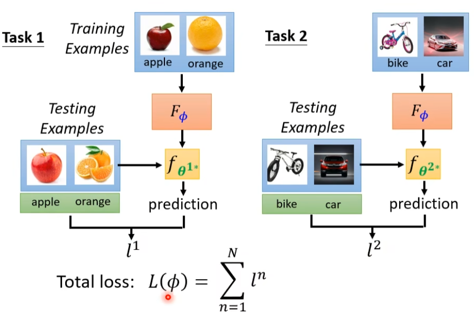
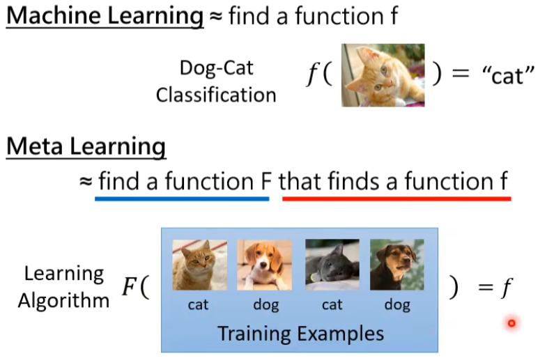
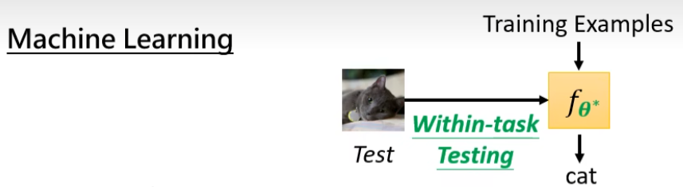
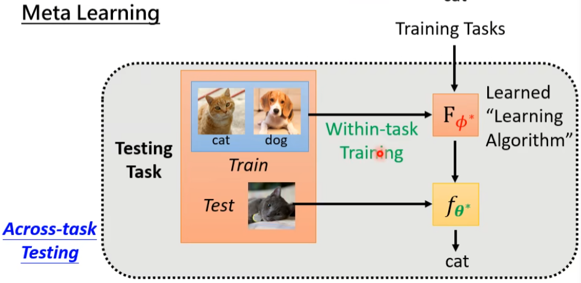
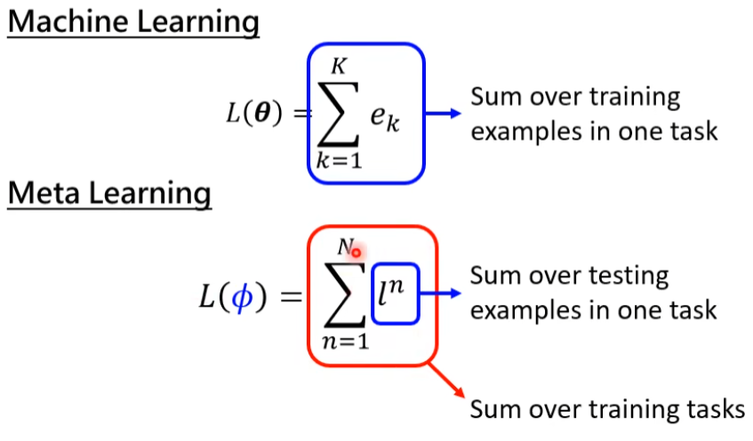

## Meta Learning

machine learning = find a function

meta learning = find learning algorithm

==step 1:==

**learning algorithm**

Component:(need to study parts)

- Net Architecture
- Initial Parameters
- Learning Rate

==step 2:==

Define loss function(L($\phi$)) for learning algroithm$F_\phi$

将一个分类任务拆分为很多小的二元分类任务

用测试资料算loss

==step 3:==

- Loss function for learning algorithm $L(\phi)=\sum_{n=1}^Nl^n$
- Find$\phi$that can minimize L($\phi$) $\phi^\ast = argminL(\phi)$
- Using the optimization approach you know
  - Gradient descent
  - Reinforcement Learning

Machine Learning & Meta Learning

**diference**

- object

- Training Data

Machine Learning	one task(Within-task Training)

Meta Learning	training task & Testing task(Across-task training)

- Loss

**same**

- Overfitting on training tasks
- Get more training tasks to improve performance
- Task augmentation
- There are also hyperparameters when learning a learning algorithm

**example**

MAML & Pre-tarining

NAS(Network Architecture Search)

Data Augmentation

**Application**

few-shot Image Classification

