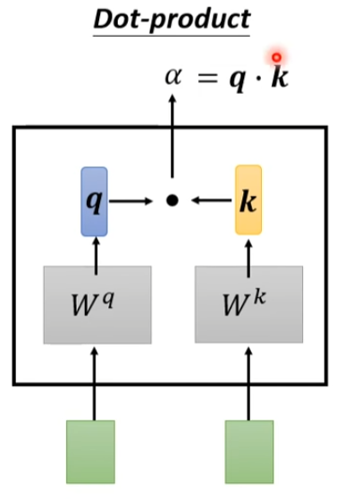
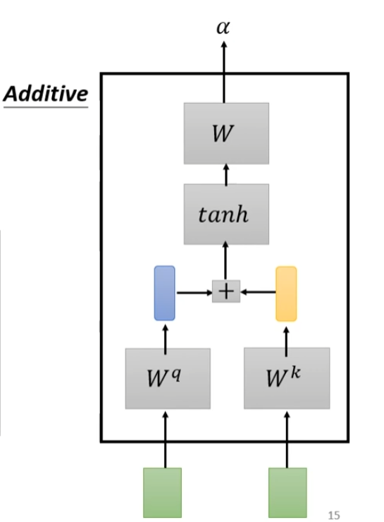
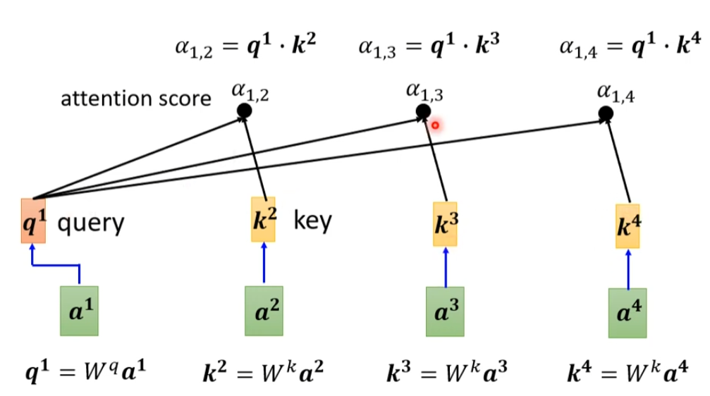
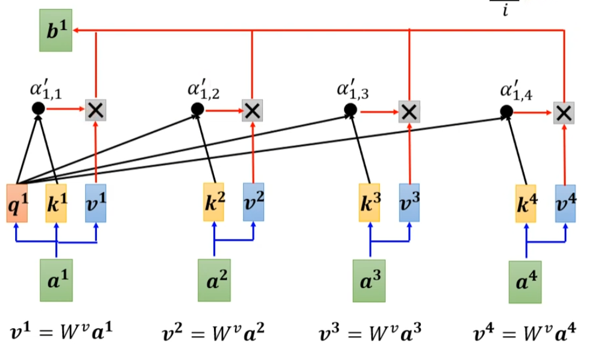
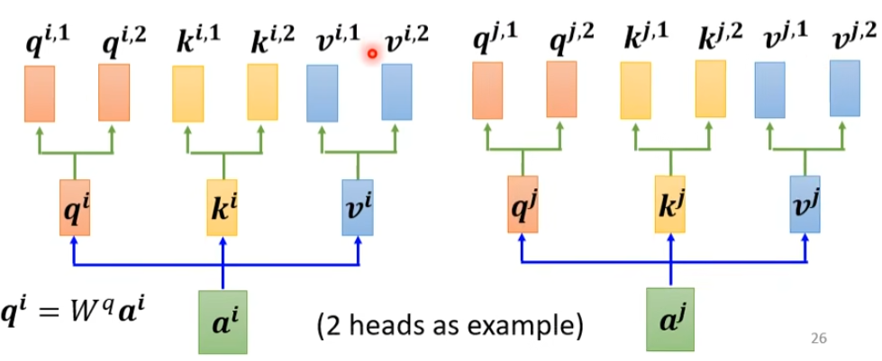
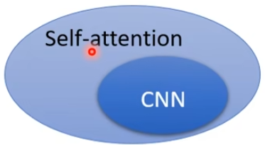

#### Self-attention

**Background**：

输入是一个序列或者一堆向量，长度会改变。如：文本，声音，图

- 文本：  每个句子或词为一个向量
- 声音： 每一小段声音序列为一个向量
- 图：每个像素点（R-G-B三通道）是一个向量

ps:词汇用向量表示（one-hot encoding）缺陷：向量之间无联系。

​                                 （word embedding）

输出是一系列向量（对应输入）或一个label（评价）或不确定的label（seq2seq）

- 一系列向量(label)，与输出对应。如词性标注（POS tagging），实体识别
- 一个向量（label）如情感分析（积极，消极），语者辨识（说话者的身份），商品推荐（买，不买）
- 一系列向量，数量不定。如机器翻译

**Construction**：

输入一系列向量（可以由上个环节生成，也可以是初始向量）ai（i=1,2,3...n）

输出一系列向量 bi（i=1,2,3...n）

- 计算每个a之间的相关性得分α，α的计算方式如下
    
    - method one
    
     
    
    - method two
    
     
    
     一般使用点积较多，也就是第一种方式
    
     
    
     当前ai的q通过与每个ai所对应的ki点积运算，得到对应αi（attention score）
    
- 将得到的α丢进soft-max函数得到α‘  （归一化）Normalization

- 计算bi

每个ai乘上一个权重矩阵Wv得到vi，计算每个vi与αi的点积获得该ai在b中的占比，将每一个占比累加到一起得到b，因此如果ai之间的关联度越高，它在b中得到的权重越大。可以理解为这两个a关系密切。

- 得到b向量（self-attention结束），进行后续操作

**feature**：

- 考虑整个context的信息
- self-attention 本身没有考虑位置信息，可以手动加入带有位置信息的ei
- 运算量大

**Expansion**:多头自注意力（multi-head  self-attention）多种相关性

self-attention与CNN的关系

**Applycation**:

- 文字
- 语音
- 图像：可以将图像某点的RGBchannel当成一个向量，则图像由多个向量构成
- 图

相关文章 《attention is all you need》