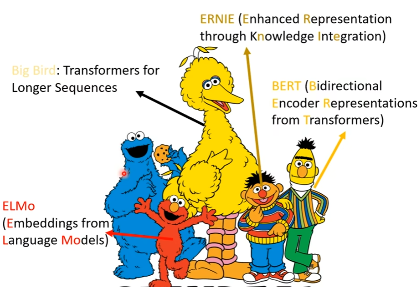
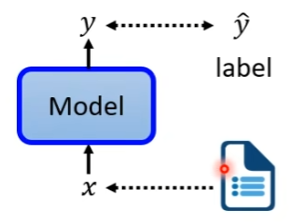
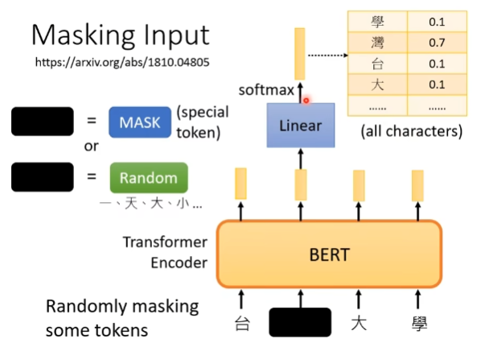
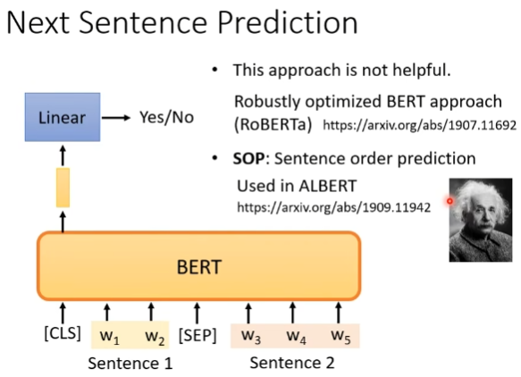
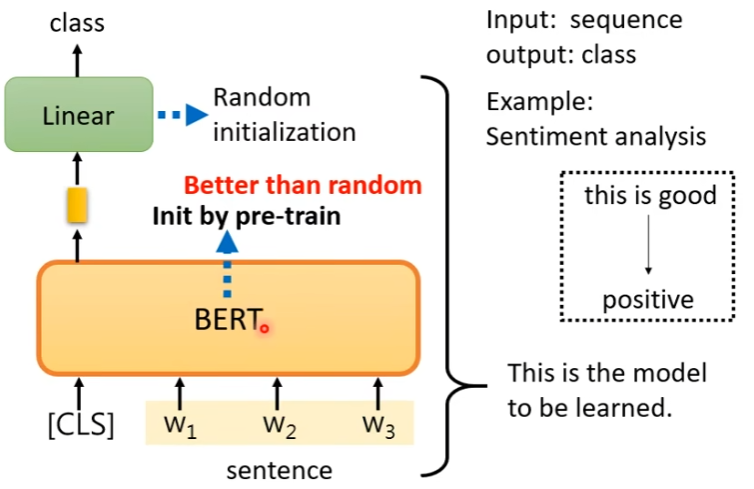
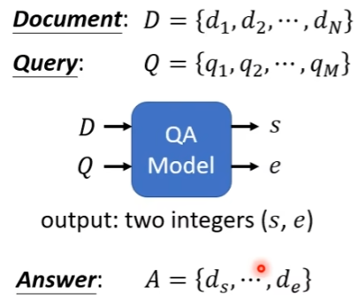
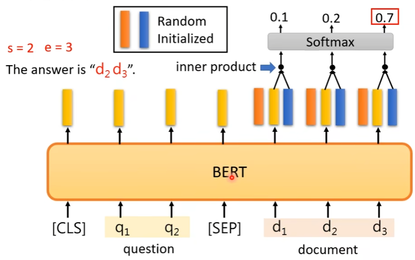

**Self_Supervised**

**Supervised**

有人工标注的数据集$y^*$去判断模型生成的y

**Self-Supervised**

不带人工标注，模型自己产生$x^‘$和$x^{’’}$，将产生的y与$x^{’’}$比较。如填空，判断两个句子的关系。

**BERT**的两种模式

Masked token prediction

盖住某个token（字符，单词），让模型去预测盖住的单词是什么。

Next Sentence Prediction

给两个句子，让模型去判断这两个句子是否有关联。

==BERT是pre-train(预训练)模型，它是在通用的大规模语料库中训练好的，我们可以拿过来fine-tune（微调）一下参数用在我们的任务上。当然，你也可以自己训练一个BERT。==

**Application**

case one

input:sequence

output:class

example:sentiment analysis

case two

input:sequence

output:same as input

example:POS tagging

case three

input:two sequences

output:a class

example:Natural Language Inferencee(NLI)自然语言推理

case four

input:two sequences

output:two integers

example:Extraction-based Question Answering(QA)问答/阅读理解

CBOW(word embedding)&BERT(Contextualized word embedding)

相同点：都是给定上下文，根据上下文去预测input的词。

不同点：在CBOW中，每个单词都会成为Input,而在BERT中，只有15%（自定义）的词会被MASK

​               CBOW输入的是待预测词的上下文，BERT输入的是一个完整的句子。

​               CBOW无法处理一次多义，BERT可以（attention）