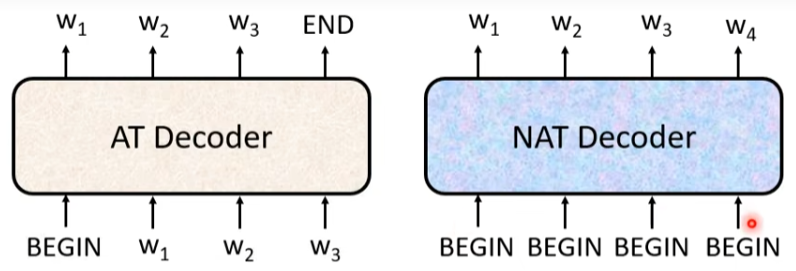

#### Transformer —Sequence-to-Sequence(Seq2seq)

**Appication**:

- example:语音辨识（speech recognition）
- 机器翻译(machine Translation)
- 语音翻译(speech translation)
- 语音合成（Text-to-speech）
- chatbot（聊天机器人）
- QA can be done by seq2seq

多分类（Multi-class classification）  vs  多标签（multi-label classification）

多分类是指一条数据只有一个label，每个label对应一个类别（一种分类方式）。如：猫是动物

多标签是指一条数据可以有多个label，对应多个类别（多种分类方式）。如：猫是动物，属于猫科，小型

**construction**:

Transformer主要分为四个部分，input（输入）—encoder（编码）—decoder（解码）—输出（output）

- Input

输入一般为序列（sequence）如：文字序列，语音序列等

- Encoder
	- Structure
	
	
	
	由多个相同的单元构成，每个单元有attention，residual，norm，Fully Connected组成
	
	- input&output
	
	
	
	输入一系列的向量输出一系列的向量，向量个数相同。
	
	- block
	
	
	
	每个block中包含注意力机制和一个全连接层，将当前block的输入和输出累加（residual= input + output）再进行norm操作后喂入下一层block，这里的Norm方式采用Layer Norm。batch norm?
	
	

- Decoder
	- AT(autoregressive)
	  
	  
	  - input
	  
	  encoder的输出和自身的输入。其中自身的输入是当前输入是之前的输入+上一次的输出，如图第一次输入begin，第二次输入begin+机。因此它用到的注意力是Masked self-attention
	  
	  
	  - output
	  
	    得到的结果，如机器学习
	
	
	- NAT
	- AT    VS    NAT
	
	
	
	- NAT的两种输入方式：
	
	  - 喂足够长的seq，忽略end后面的
	
	  -  单独加一层确定seq长度
	- 特点：
	  
	
	
	NAT可以更加parallel(平行化)，controllable output length(长度可控)，但是效果不如AT
	
- encoder&decoder

- output

result

cross entropy(交叉熵)

**teacher forcing**:using the ground truth as input

**Tips**:

copy mechanism(Chat-bot)从输入中复制一部分下来

guided attention(给attention加入一些限制)

beam search(根据任务而异)