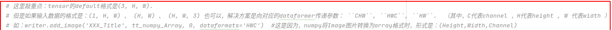

### random_split()

数据划分方法

```python
torch.utils.data.random_split(dataset, lengths, generator=<torch._C.Generator object>)
```

- `dataset` (Dataset) – 要划分的数据集。
- `lengths` (sequence) – 要划分的长度。
- `generator` (Generator) – 用于随机排列的生成器。

> input:

```python
import torch
from torch.utils.data import random_split
dataset = range(10)
train_dataset, test_dataset = random_split(
    dataset=dataset,
    lengths=[7, 3],
    generator=torch.Generator().manual_seed(0)
)
print(list(train_dataset))
print(list(test_dataset))
```

> output:

```python
[4, 1, 7, 5, 3, 9, 0]
[8, 6, 2]
```

### cat()

拼接tensor

input:

```python
import torch
#定义x1,x2
x1=torch.tensor([[1,2,3],[4,5,6]],dtype=torch.int)
x2=torch.tensor([[7,8,9],[3,2,1]],dtype=torch.int)
x=[x1,x2]
out_one=torch.cat(x,dim=0)# 2x3  ->  4x3
out_two=torch.cat(x,dim=1)# 2x3  ->  2x6
print(out_one)
print(out_two)
```

output:

```python
tensor([[1, 2, 3],
        [4, 5, 6],
        [7, 8, 9],
        [3, 2, 1]], dtype=torch.int32)
tensor([[1, 2, 3, 7, 8, 9],
        [4, 5, 6, 3, 2, 1]], dtype=torch.int32)
```

### enumerate()

enumerate多用于在for循环中得到计数，利用它可以同时获得索引和值，即需要index和value值的时候可以使用enumerate

```python
s = [1, 2, 3, 4, 5]
e = enumerate(s)
for index, value in e:
    print('%s, %s' % (index, value))
 
```

output:

```python
0, 1
1, 2
2, 3
3, 4
4, 5
```


**torch.backends.cudnn.deterministic**

将这个 flag 置为True的话，每次返回的卷积算法将是确定的，即默认算法。
如果配合上设置 Torch 的随机种子为固定值的话，应该可以保证每次运行网络的时候相同输入的输出是固定的。


**torch.backends.cudnn.benchmark**

- 如果网络的输入数据维度（包括 batch size，图片大小，输入的通道）或类型上变化不大，设置 torch.backends.cudnn.benchmark = true 可以增加运行效率；
- 如果网络的输入数据在每次 iteration 都变化的话，会导致 cnDNN 每次都会去寻找一遍最优配置，这样反而会降低运行效率。
  

**torch.manual_seed(seed)**

- 设置 CPU 生成随机数的 种子 ，方便下次复现实验结果。
- 为 CPU 设置 种子 用于生成随机数，以使得结果是确定的。
- 当你设置一个随机种子时，接下来的随机算法生成数根据当前的随机种子按照一定规律生成。
  随机种子作用域是在设置时到下一次设置时。要想重复实验结果，设置同样随机种子即可。

==类似的功能函数==

**torch.cuda.manual_seed(seed)**	为特定GPU设置种子，生成随机数

**torch.cuda.manual_seed_all(seed)**	为所有GPU设置种子，生成随机数


**torch.utils.tensorboard.SummaryWriter**	训练过程可视化

- log_dir 保存summary的位置，可以不写

常用函数：

- add_scalar()	添加一张图到summary中
  - tag	描述该图的标题
  - scalar_value    y轴
  - global_size      x轴
- add_image()    添加一张图片到summary中
  - tag    标题
  - img_tensor    数据类型必须是torch.Tensor,numpy.array或字符串
  - global_step     x轴


==tips==




**一次batch：**

```python
for i, batch in enumerate(tqdm(train_loader)):
        features, labels = batch
        features = features.to(device)
        labels = labels.to(device)
        outputs = model(features) 
        loss = criterion(outputs, labels)
        
        optimizer.zero_grad() 
        loss.backward() 
        optimizer.step() 
```

1. 获取loss,通过标签和特征，计算loss
2. optimizer.zero_grad() 清空过往梯度；
3. loss.backward() 反向传播，计算当前梯度；

   4.optimizer.step() 根据梯度更新网络参数

进来一个batch的数据，计算一次梯度，更新一次网络

#### nn.LSTM

```python
torch.nn.lstm(input_size,hidden_size,num_layers,bias,batch_first,dropout,bidirectional)
```

- input_size:表示的是输入的矩阵特征数，或者说是输入的维度
- hidden_size:隐藏层的大小（即隐藏层节点数量），输出向量的维度等于隐藏层节点数
- num_layers:lstm隐层的层数，默认为1
- bias：隐层状态是否带bias,默认为True
- batch_first:输入输出的第一维是否为 batch_size，默认值 False。因为 Torch 中，人们习惯使用Torch中带有的dataset，dataloader向神经网络模型连续输入数据，这里面就有一个 batch_size 的参数，表示一次输入多少个数据。 在 LSTM 模型中，输入数据必须是一批数据，**为了区分LSTM中的批量数据和dataloader中的批量数据是否相同意义**，LSTM 模型就通过这个参数的设定来区分。 如果是相同意义的，就设置为True，如果不同意义的，设置为False。 torch.LSTM 中 batch_size 维度默认是放在第二维度，故此参数设置可以将 batch_size 放在第一维度。如：input 默认是(4,1,5)，中间的 1 是 batch_size，指定batch_first=True后就是(1,4,5)。所以，如果你的输入数据是二维数据的话，就应该将 batch_first 设置为True
- dropout：默认值0，除最后一层，每一层的输出都进行dropout
- bidirectional：如果设置为 True, 则表示双向 LSTM，默认为 False

#### `DataParallel` 和 `DistributedDataParallel` 区别

- 如果模型太大而无法容纳在单个GPU上，则必须使用 **model parallel** 将其拆分到多个GPU中。 DistributedDataParallel与模型并行工作； DataParallel目前不提供。
- DataParallel是单进程，多线程，并且只能在单台计算机上运行，而DistributedDataParallel是多进程，并且可以在单机和分布式训练中使用。因此，即使在单机训练中，您的数据足够小以适合单机，DistributedDataParallel仍要比DataParallel更快。 DistributedDataParallel还可以预先复制模型，而不是在每次迭代时复制模型，并且可以避免PIL全局解释器锁定。
- 如果数据和模型同时很大而无法用一个GPU训练，则可以将model parallel（与DistributedDataParallel结合使用。在这种情况下，每个DistributedDataParallel进程都可以model parallel，并且所有进程共同用数据并行


## 损失函数

> nn.MSELoss（）

reduction参数：

- none
- mean
- sum

```python
import torch
import torch.nn as nn

a= torch.tensor([[1,2],
                [3,4]],dtype=torch.float)
b= torch.tensor([[3,5],
                [7,9]],dtype=torch.float)
#对应位置相减求平方
loss_fn1 = torch.nn.MSELoss(reduction='none')
loss_1 = loss_fn1(a.float(),b.float())
print('loss_1:',loss_1)
>>>loss_1: tensor([[ 4.,  9.],
        [16., 25.]])
    
#对应位置相减求平方求和   
loss_fn2 = torch.nn.MSELoss(reduction='sum')
loss_2 = loss_fn2(a.float(),b.float())
print('loss_2:',loss_2)
>>>loss_2: tensor(54.)
    
#对应位置相减求平方求和求平均
loss_fn3 = torch.nn.MSELoss(reduction='mean')
loss_3 = loss_fn3(a.float(),b.float())
print('loss_3:',loss_3)
>>>loss_3: tensor(13.5000)
```

## Optimizer

>SGD 随机梯度下降

```python
opt_SGD = torch.optim.SGD(net_SGD.parameters(),lr)
```

> momentum 动量加速

```python
opt_momentum = torch.optim.SGD(net_momentum.parameters(),lr,momentum=0.9)
```

> RMSprop

```python
opt_RMSprop = torch.optim.RMSprop(net_RMSprop.parameters(),lr,alpha=0.9)
```

> Adam

```python
opt_Adam = torch.optim.Adam(net_Adam.parameters(),lr,betas=(0.9,0.99))
```

## 模型的一些超参

- **Batch**  batch大小决定了数据集被划分成多少块，如样本有100，batch=5，则会产生20个batch，每个batch结束后，模型的权重将会更新。
- **Epoch**   epoch决定了每个训练过程中训练的次数，一个epoch包含所有样本的一次更新，即20个batch。如果epoch设为100，则该过程循环100次，每次更新20个batch，总共更新2000个batch。


**example**

covid-9预测

- input
- model
- output

语音分类

- input
- model
- output

美食分类

- inoput
- model
- output

### 一些遇到的错误

 **CUDA error: device-side assert triggered CUDA kernel errors**

数组越界问题，最好先在cpu上调试，找到越界的地方后在换成GPU跑

 **IndexError: Target -1 is out of bounds.**

因为文件读取的问题，训练集中的分类标签没有读取到，程序默认如果没有读取到分类标签则为-1。在训练模型的时候只有0-10的标签，所以报**Target -1 is out of bounds**错误

==tips：==

数据增强（transform）

- 随机剪裁：transforms.RandomCrop

  - size（sequence/int）如果是sequence，则（h,w）,如果是int,则（size，size）
  - padding（sequence/int,optional）,设置填充多少个pixel
  - fill（int/tuple）
  - padding_mode(1.constant 常量。2.edge 按照图片边缘的像素值来填充。3.reflect  暂不了解。 4. symmetric  暂不了解。)

- 中心裁剪：transforms.CenterCrop

  - size（sequence/int）如果是sequence，则（h,w）,如果是int,则（size，size）

- 上下左右中心裁剪：transforms.FiveCrop

  对图片进行上下左右以及中心裁剪，获得5张图片，返回一个4D-tensor

  - size（sequence/int）如果是sequence，则（h,w）,如果是int,则（size，size）

- 上下左右裁剪后翻转：transforms.TenCrop

  对图片进行上下左右以及中心裁剪，然后全部翻转（水平或者垂直），获得10张图片，返回一个4D-tensor。

  - size（sequence/int）如果是sequence，则（h,w）,如果是int,则（size，size）
  - vertical_flip(bool)  默认垂直翻转，false时为水平翻转

- 依概率p水平翻转：transforms.RandomHorizontalFlip

  - p(默认值0.5）

- 依概率p垂直翻转：transforms.RandomVerticalFlip

  - p(默认值0.5）

- 随机旋转：transforms.RandomRotation

  - degress(sequence or float or int)
  - resample(PIL.Image.NEAREST, PIL.Image.BILINEAR, PIL.Image.BICUBIC)默认为最近邻
  - center（中心旋转or左上角旋转）

- 尺寸变换：transforms.Resize

  - size(h*w)
  - interpolation  插值方式选择，默认为PIL.Image.BILINEAR

- 标准化：transforms.Normalize

  对数据按通道进行标准化，即先减均值，再除以标准差，注意是 h*w*c

- 转为tensor：transforms.ToTensor

  将PIL Image或者 ndarray 转换为tensor，并且归一化至[0-1],归一化至[0-1]是直接除以255

- 修改亮度、对比度和饱和度：transforms.ColorJitter

  class torchvision.transforms.ColorJitter(brightness=0, contrast=0, saturation=0, hue=0)

- 将数据转换为PILImage：transforms.ToPILImage

- transforms.RandomApply(transforms,p=0.5)

  给一个transform加上概率，以一定的概率执行该操作

- transforms.RandomOrder

  将transforms中的操作顺序随机打乱
